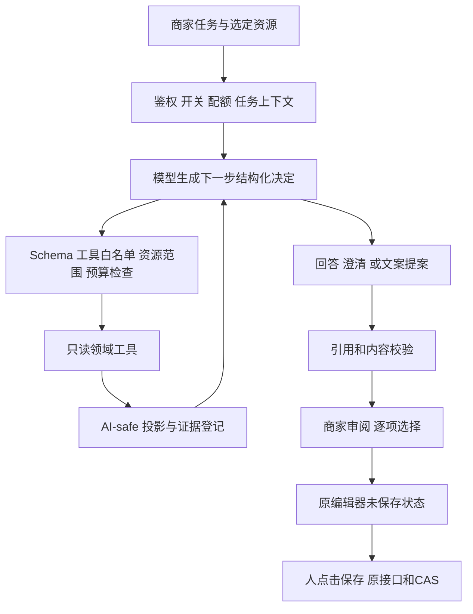

# 商家经营 Agent V1：任务调查、发布诊断与文案提案

| 项目 | 内容 |
| --- | --- |
| 文档 ID | SPEC-MERCHANT-AGENT-001 |
| 版本 / 日期 | 0.2.0 / 2026-10-07 |
| 状态 | 待评审实施方案；尚未实现，不代表模型评测或上线验收通过 |
| 实施分支 | 工作台、Node 22、商品 AI 助手依次合入 develop 后，从该 develop 新建 `feat/merchant-operations-agent` |
| 方案分支 / 工作区 | `docs/merchant-operations-agent` / `/root/projects/worktrees/monexus-merchant-agent-plan`；仅文档，不承载依赖整合 |
| 前置功能 | 商家待办工作台 `2207350`；其 `docs/specs/merchant-workbench-v1.md` 为历史验收依据，待独立 PR 合入 |
| 配套 | [实施与验收计划](./merchant-operations-agent-v1.plan.md) |

## 1. 本次必须交付什么

交付一个商家可用自然语言委托任务的 Agent：模型决定下一步调用哪个只读工具、读取哪个已授权对象，根据工具返回决定继续调查、向用户澄清或结束，并可为选定商品准备可逐项采纳的文案提案。人检查后仍走原有编辑器保存与发布。

这次不能以规则卡片、定时巡检、固定步骤串联，或给卡片生成解释，替代 Agent 验收。旧工作台继续是独立的确定性功能，也是 Agent 的事实入口。

**最小完整闭环：**“看看我今天该处理什么” → Agent 选择查询 → 展示事实与处理建议 → 商家选择一件草稿 → Agent 检查并按需读取公开内容 → 提出文案或请求补充 → 商家在原编辑器逐项采纳、保存 → 重新检查实际缺项。文案功能属于 V1 必需交付，不再无限推迟到 V1.1。

### 1.1 三条核心任务

| 任务 | Agent 实际工作 | 成功边界 |
| --- | --- | --- |
| 今天先做什么 | 按问题选择紧急事项/低库存/草稿工具，结合返回结果列出有依据的处理步骤；按商家关注对象继续钻取 | 紧急事实完整性与截断由代码展示；不凭空解释销量原因，不擅自降低紧急等级 |
| 这个商品为什么不能发布 | 找到商家指定商品，运行与发布一致的 readiness，解释缺项并给出精确操作位置；歧义时让人选择 | 明确是哪些条件未满足；不能承诺补一处必定发布；覆盖非草稿商品的检查用途与不可编辑状态 |
| 帮我完善这个商品的说明 | 读取这个商品允许外发的内容与结构化参数；基于已有内容/本轮公开补充生成六字段范围内的候选 | 真实产生可审阅提案；只有人选中的字段能填入未保存表单；缺事实时追问或留空 |

示例：“今天先看人工服务订单，草稿稍后再说”不应调用草稿批量检查；“这个商品还缺什么”应直接查选定商品；“给它补一段购买须知”应先取授权内容上下文，不能只读待办摘要就编造内容。这些差异须由真实模型工具轨迹证明。

### 1.2 不属于首期

后台无人值守运行、自动发布/下架、自动改库存或价格、自动处理订单/退款、经营预测、利润/推广归因、买家聊天、争议回复、管理员运营 Agent、网页浏览、任意 SQL、Shell、MCP 对外服务、Jev 意图路由、多 Agent、长期记忆、向量库、文件上传、生成图片、新建商品。新建商品继续使用已有独立草稿助手。

## 2. 网上落地案例：借鉴与取舍

核查日期 2026-10-07。下面只使用已抓取的官方材料，不沿用此前未验证的销售提升数字。帮助中心是动态文档，发布日期未标注时不推断发布日期。Grok 搜索连续两次空结果、配置诊断证书失败后，搜索回退 Exa；正文抓取使用可用的 Grok fetch。

| 来源 | 已核实内容 | 对本项目的决定 |
| --- | --- | --- |
| [Shopify Sidekick](https://help.shopify.com/en/manual/ai-powered-tools/sidekick) | 后台对话、理解店铺上下文、生成内容并处理任务；修改先让商家审阅 | 入口放商家后台，与正在操作的商品关联；调查与提案连起来 |
| [Sidekick 帮助与操作](https://help.shopify.com/en/manual/ai-powered-tools/sidekick/help-and-guidance) | 可以按用户指示填表，标出生成内容；订单修改须审阅并点 Update order，内容修改仍需保存；可引用特定资源 | 复用当前表单和保存接口，不另建审批业务流；先实现商品公开说明，不能照搬资金或订单编辑 |
| [Sidekick Pulse](https://help.shopify.com/en/manual/ai-powered-tools/sidekick/pulse) | 首页最多五项建议；点击后进入对话并建立任务列表；逐项批准修改 | 旧待办卡片成为对话入口；首期不复制后台研究、跨会话记忆与忽略偏好 |
| [Anthropic：Building effective agents](https://www.anthropic.com/engineering/building-effective-agents)（2024-12-19） | 区分预设流程与模型动态选工具；每步以环境返回为依据，设置停止条件，重视工具文档与评测 | 单 Agent、受限工具集合、服务器控制循环。文章已提示工具生态后来有变化，本文仅引用其架构原则，不作为最新 SDK 比较 |

这些材料证明的是能力与设计模式，不证明 MoNexus 的经营收益。Shopify 的客户、订单、资金及第三方应用权限远大于本项目需求；不复制其所有工具。没有必要为了“是 Agent”引入浏览器代理或框架。

## 3. 仓库事实与依赖决策

### 3.1 工作台历史基线 `2207350` 已有

- `server/src/modules/merchant/workbench/service.ts`：`getUrgent`、`getAvailability`、`getDrafts`、`getItem`，包含完整数量、局部失败、截断及批次信息。
- `server/src/modules/merchant/workbench/repository.ts`：归属限定的查询与草稿检查；readiness 使用发布默认口径。
- `server/src/modules/merchant/routes.ts`：authenticate → requireActiveUser → requireMerchant；新 Agent 路由仍在此权限链内。
- `src/stores/merchantWorkbench.ts`：会话失效、请求顺序和草稿检查状态保护；不得把新 Agent 状态混进这套规则状态机。
- `src/components/merchant/workbench/navigation.ts`、`productEditor/editorFocus.ts`：封闭导航；复用，不让模型拼 URL。
- `ProductEditPage.tsx`、catalog `productWrite.ts`：现有表单与 contentVersion/CAS，保存和发布仍为权威。
- 当前 `.nvmrc` 是 Node 20；该基线没有 `server/src/lib/ai`，没有 AI Provider 或 AiGeneration 表。

### 3.2 另一个分支的观察，不是本分支已经具备

只读核对 `/root/projects/worktrees/monexus-ai-copilot-feat`；观察到其 HEAD 在工作期间从 `ac79f72` 前进到 `c0964c2`，存在其他尚未提交的认证 UI 改动。不得复制未提交文件，不修改该工作区。

- `docs/specs/ai-foundation.md` 1.2.0：AI-safe Projection、统一配置、配额、元数据、未来 Agent 工具规则。
- `server/src/lib/ai/provider.ts`：仅有 `generateStructured`，不是已有工具循环。
- `server/src/lib/ai/generation.ts`：单次模型调用；feature 目前只有 `product_content_copilot`，target 只有 product/product_draft；不能冒用其额度或反复调用以伪装成一个 run。
- `contentCopilot/service.ts::generateContentSuggestion`：权限读取、版本检查、上下文构造、一次生成与校验耦合在一起，需要小范围拆分以共享准备与校验，不复制整套逻辑。
- `contentCopilot/projection.ts::buildProductContentAiContext`、`validator.ts::validateModelOutput`、`outputSchema.ts`：可复用的商品文案边界。
- 现有六字段：description、highlights、usageInstructions、purchaseNotes、afterSalesInstructions、faq；没有价格/库存/状态。
- AI 分支已要求 Node 22，且含 SDK、Provider 配置和数据库迁移。其新建商品助手最近文档记录的 L3 为 5/6，不得宣称另一个分支全部模型能力已验收；该新建能力不是 Agent 的依赖质量证据。

### 3.3 分支与 PR 顺序（本次修订替代原集成路线）

1. 工作台 V1 保持 `feat/merchant-workbench` / `2207350`，Node 20，单独向 develop 提 PR 并按原范围打 run-e2e；原本地验收证据保留，不在该分支合入 AI 或运行时升级。
2. Node 22 先以独立 chore PR 合入 develop；由该 PR 处理 engines、lockfile、Docker/CI/runtime check 与升级回归。
3. 商品 AI 助手再以独立 feat PR 合入 develop；以 Node 22 为基线，处理 Provider、配置、元数据迁移、内容 Copilot，以及与已合入工作台的编辑器/发布检查接缝。AI 分支12个未推送提交不是可直接整体并入工作台的交付单元，实施前重新核对其拆分。
4. 三个依赖都合入后，从新的 develop 创建 `feat/merchant-operations-agent`。记录各 PR、合入 SHA、起点 SHA 与迁移列表；Agent 后续只正常同步 develop，不再承担前三项功能的发布整合。

`2207350` 保留为需求与回归基线，而不是未来 Agent 的实际代码起点。工作台在 Node 20 上的验证只证明该历史版本；Node 22 升级和商品 AI PR 各自承担引入变化后的回归，不能把旧证据挪作新基线通过证明。

当前两份未提交文档已移出工作台，暂存独立文档分支；不向工作台提交方案。不在方案阶段推送、开 PR、合并依赖或升级运行时。未来文档可独立评审或随 Agent 分支迁入；开发依赖未合入时仅推进方案/评审，不建立第二套 AI 实现。

## 4. 总体结构：模型选工具，服务器持有执行权



### 4.1 选择薄循环，不先引入 Agent SDK

首期沿用 `generateStructured`，模型输出封闭的“调用工具/结束/澄清/准备文案”决定，服务器解析后执行并把工具结果送入下一次模型调用。这是应用层工具调用协议：**工具序列由模型动态决定，执行权限由代码限定**。不依赖 Provider 原生 function calling，不把 JSON 格式化本身称为 Agent。

原因是现有 Responses/Chat/Anthropic adapters 都实现同一个结构化接口；强行要求原生工具调用会同时扩大三个协议适配面。模型是否真的能正确选工具必须用 L3 验证，JSON schema 支持并不等于工具规划能力。

保留单次生成的原业务语义；Provider 请求中的推理选项按下节显式扩展，不声称类型契约完全不变。新增 `runAiTask` 公共受控执行容器，`runAiGeneration` 成为它的单调用消费方，Agent 使用多步消费方。Provider 只能由该运行时持有的受控 `generate` 方法调用。Feature 不能直接获取 Provider，不能绕过配额、超时、元数据与取消。

### 4.2 推理模式：明确类型、协议和评测配置

c0964c2 的 `LlmStructuredRequest.reasoningEffort` 和 `RunAiGenerationArgs.reasoningEffort` 都仅允许 `'none'`；但 adapter 只有在运行时 reasoningMode=none 时才发送禁用推理参数，default 时省略。因此“类型写none”不等于每次线上都禁用推理，也不能据此保证 Agent 规划质量。

本期决定：统一请求增加/迁移为 `reasoningMode: 'none' | 'default'`，default 意味着服务商默认，不代表已保证某种推理强度。`runAiTask` 接收同一类型。原 `runAiGeneration` 调用签名可保留兼容入口，但必须把其旧参数与原后台 reasoningMode 映射为同样的既有线上行为；不能为了 Agent 改变商品 Copilot 的推理配置。

新增 Agent 专属 `merchantAgentReasoningMode`（默认default），沿后台配置版本与快照生效，不改变全局现有 reasoningMode。Agent规划和专用文案步骤均使用该run的有效模式；复用的是文案prompt/schema/validator，新的调用模式须独立评测。所有 Provider 的name/元数据必须反映实际生效模式，不能记录原全局模式。

- default：Responses省略reasoning，Chat省略reasoning_effort，Anthropic省略thinking；不追加模型专属参数。
- none：分别发送现有none/disabled参数；不支持的服务返回错误，不自动切换参数。
- V1不开放low/medium/high或Anthropic预算映射；若default无法达到L3，停止启用，单独修订模式与adapter后再评测，不靠硬编码猜协议支持。

L3主验收使用 **Agent default**，记录精确模型、协议、输出模式和有效推理模式；none可作为对照，不能替代主验收。若运营明确选择none上线，则必须对none配置另跑完整L3。升级请求类型需覆盖三种adapter映射及旧Copilot无行为变化测试。

## 5. 工具目录与作用域

工具内部调用 service，不向本机 HTTP 再转发用户 Cookie/token。工具参数 strict，均不得包含 merchantId/userId/角色、任意 URL、SQL、动态字段路径。

| 工具 | 模型参数 | 实现与界限 |
| --- | --- | --- |
| `read_workbench` | `group: urgent | availability | drafts`，drafts 可带本轮合法 cursorRef | 复用四类 service 中的列表读取；每次 drafts 仍检查20个，最多两批；模型投影每组最多10张候选，截断与未检查信息必须保留 |
| `find_products` | `query` 1..80 字，`status: draft | active | any` | 新增归属限定只读查询，名称/明确ID匹配，最多10项，排除归档；不做语义向量搜索，不返回完整商品 DTO；多候选须让用户选 |
| `inspect_product` | `productRef` | 校验本轮可用资源后，读取是否归档/状态及与发布相同的 readiness；不能仅用“草稿规则不命中”推断 active 商品发布条件完整；外来/不存在统一 not_found |
| `read_item` | `itemRef` | 复用 `getItem`；支持订单/库存/草稿单项复核。订单只提供 SLA 与状态证据，不提供完整订单时间线或内部备注 |
| `read_product_content` | `productRef`，`targetFields` 六字段子集 | 复用拆出的内容 Copilot 准备服务与专用投影，记录 contentVersion；只读。无模板/归档/无权限则不给可生成上下文 |
| `read_help` | `topic` 封闭枚举 | 平台维护的本地说明：发布缺项、可售量、人工履约、文案边界；不读整仓 docs，不包含提示/配置/内部运维材料 |

`find_products` 是能力扩展，不能假定现有商品列表接口直接适合模型。按 merchantId 限定、有限结果、不 select 交付内容。每个工具需有适用/不适用说明、参数示例、返回状态和空值语义，随 prompt 版本管理。

### 5.1 资源引用

服务器为本 run 已授权资源生成不透明 `productRef/itemRef/evidenceRef/actionRef/cursorRef`，保存于请求内存映射。模型仅可引用当前映射；输入中编造引用直接拒绝，不能因此探测数据库。客户端选中商品的数字 ID 是读取请求，不是授权证明：先验证归属再映射。订单归属始终用 `Order.merchantId`。

每次工具执行仍重验 active 用户/商家状态、资源归属与开关。返回前重验本次涉及资源的访问权限；权限撤销/转移后清除相应结果，不能只靠开始时的一次鉴权。若等待中实际会话被撤销，执行容器须使用现有会话查询逻辑检查有效性，而不是信任已解析的旧 req.user。

外来资源与不存在资源统一 not_found；单资源失效不解释成整个 Agent 关闭。工作台旧 404 契约不变，Agent 使用独立的 availability 端点区分功能状态。

### 5.2 两份输出，不能误把工作台 DTO 当 AI-safe

工具生成 `modelContext` 与 `viewEvidence` 两份投影：

- `modelContext.facts`：规则、紧急档位、readiness code、允许操作类别、覆盖范围、可继续标记、非敏感引用；按领域事实判断的 unknown 必须保留。
- `modelContext.untrusted`：有限长度的商品名称、明确公开的商品内容、商家问题/补充；永不升级为权限或系统指令。
- `declared`：沿现有内容 Copilot 的模板声明语义，不将营销文案变成可信事实。复用 Context 的历史类型布局时保留字段分级注释，不为统一布局改坏原校验器。
- `viewEvidence`：面向商家显示的真实名称、库存数、截止时间、更新时间、完整匹配数与封闭动作；不发送给 Provider。
- V 级价格/库存数/名额/销量及具体履约时间不进模型文字；模型只见 sold_out/low/due_soon/overdue 等档位。准确数值由服务器卡片渲染。本期不计算补货量、价格建议和预计卖空时间。
- S 级邮箱、昵称、购买资料、备注、卡密、交付内容、外部 SKU、凭据等不得进入任何模型上下文。用户自由输入没有完美自动脱敏保证：UI 明示只输入经营问题和公开介绍，输入层拦截已知凭据/联系方式模式，L3 测试注入；不能承诺能识别任意秘密。

单工具 modelContext 默认 ≤8000 字符；商品内容沿既有 ≤24000 字符；整次模型输入（含问题、保留观察和 schema/tool docs）≤40000 字符。不能静默截断权威事实；移除不再需要的旧观察后仍超限则返回 context_limit，不调用模型。

### 5.3 检查范围

Agent 不默认全店扫草稿；一轮最多40个、readiness并发仍≤4。展示“本次检查了哪些范围”，不能把10条模型候选当作完整总数。Urgent 工具的全部候选/计数保留给原工作台；回答页独立显示紧急完整数量和查看全部入口，模型选择少量对象不能隐藏其他紧急事项。最多40个草稿不是事务一致快照。

## 6. 模型协议、循环与停止

### 6.1 下一步协议（概念类型，实施用静态 JSON Schema）

```ts
type Decision =
  | { kind: 'tool'; call: AllowedToolCall }
  | { kind: 'answer'; blocks: GroundedBlock[] }
  | { kind: 'clarify'; question: string; candidateRefs: string[] }
  | { kind: 'prepare_content'; productRef: string; fields: ContentField[] };
```

每次只选一个工具；参数额外字段拒绝。根 schema 采用固定 object + nullable 分支，避免协议对顶层 union 的兼容差异；服务端强制 kind 对应唯一有效分支。不得包含自由执行脚本、任意 URL、隐式写动作。不给前端输出推理链，工具完成记录由实际执行事件构造。

`prepare_content` 是**终结型生成步骤**：只有当前 run 已执行 `read_product_content` 且商家请求包含文案生成意图时可用。纯“看看有什么问题”不得生成或填表。没有上下文时返回工具错误，允许模型在剩余预算内选择读取；不偷偷自动编排所有查询。

### 6.2 文案生成复用方式

- 从 `generateContentSuggestion` 拆出 `prepareContentSuggestionContext(actor, productId, ...)` 与已有校验组装，保持原端点行为。
- prepare_content 使用同一个运行容器，再做一次既有内容 schema/prompt 的结构化生成；计入本 run 模型调用和 token 限额，不能再调用独立 `runAiGeneration` 导致双重配额或失去总超时控制。
- 内容生成只接收专用商品上下文和用户指定的公开补充，不把任务规划历史、其他商品、订单或“库存不足”等经营观察带进文案 prompt。
- 复用六字段 schema/validator，所有未请求字段拒绝采纳；不生成属性、价格、有效期、交付设置、分类或富文本。
- 缺依据时允许零可用字段并显示原因，不视为已完成完善任务。不能为了演示通过自动补售后承诺。
- 这不是第二个自治 Agent：它是选中后的一次专用生成步骤。无自主子任务和嵌套工具循环。

### 6.3 初始硬预算（需 L3 实测后调整，非性能承诺）

| 限制 | V1 初值 |
| --- | --- |
| 每轮规划/回答模型调用 | 最多4次 |
| 专用文案生成 | 最多1次，总模型调用≤5 |
| 领域工具调用 | 最多3次，串行；批量工具内保持既有有界并发 |
| 草稿检查 | 最多2批，共40个；不后台续扫 |
| 单 Provider 调用 | ≤15秒，同时受总 deadline 限制 |
| 整个 run | min(有效 AI_TIMEOUT_MS, 45000ms)，所有模型/工具/收尾共用 |
| 前端 | 仅 Agent POST 超时55秒，不改全局15秒或nginx60秒 |
| 输出 token | 规划单次≤1200；文案≤3000；run输出分配总额≤8000 |
| 输入预算 | 每次≤40000字符；跨调用累计≤120000字符（硬边界），token usage另外记录 |

规划超过复杂度预算时明确只完成部分调查，可让人继续一轮；不是硬凑成一次完成。典型任务明确按两轮对话设计：第一轮调查/诊断并让用户选定商品；第二轮读取该商品上下文并准备文案。复杂“总览→找商品→检查→读内容→生成”不要求在同一个run内完成。默认AI_TIMEOUT_MS=40000，因此单run实际上限40秒；5次调用和单次15秒均为独立上限，不是允许累加到75秒的预算。每次调用使用min(15000,剩余run预算减收尾余量)，无预算则停止；不延长timeoutMs+5秒的并发去重窗口。不得因时间不足返回“全部正常”。字符预算不是准确 token 或货币成本保证，不声称精确费用；依据真实 usage 评估成本。

相同工具+规范化参数同 run 只读一次，可返回该 run 缓存观察与时间，不扩大授权、不跨run缓存。重复无进展、非法工具、输出schema错误、超时、权限撤销、关开关均结束或返回明确限制。Provider错误不自动重试/换模型；工具暂时不可用可让模型选择其他允许工具，但总调用预算不增加。

到达硬上限时由代码返回“调查未完成”和已校验事实，明确这不是完整 AI 回答；不再偷偷追加总结调用。AbortSignal 贯穿模型与工具可取消路径；DB查询不支持立即取消时设置statement timeout/限定查询，停止后续工作并丢弃晚结果。

### 6.4 客户端断开与取消的服务端传播

前端AbortController必须对应到服务端连接事件，不能只丢弃UI结果。路由在启动run前注册：响应 `res.on('close')` 且 `!res.writableFinished` 时触发客户端断开中止；请求体读取中止用 `req.on('aborted')` / `req.aborted` 补充。若监听 `req.on('close')`，只能在请求确实aborted/未完整读取时中止，不能无条件abort：现代Node中正常请求体读取完成也会触发request close，响应可能仍在生成。

上述事件与总deadline连接同一个run控制器，传入task.generate及可取消工具；用稳定stopReason区分client_disconnected/timeout。finally移除监听器、清定时器、收尾元数据；连接已断开后不再尝试返回JSON。正常res.finish/完整响应后的close不算取消。取消已占额度的run仍计费，不能保证上游立即停止计费；本地必须停止后续调用并丢弃晚结果。

必须有真实HTTP断开测试：发送完整POST后、Provider替身阻塞期间关闭客户端连接，断言其signal中止、没有下一工具/生成、pending收尾为failed且stopReason正确。另测正常请求body读取完成不误取消、正常响应完成不误记failed，以及不响应AbortSignal的慢工具晚返回不会继续执行。

## 7. 回答与提案：证据能查，动作不能伪造

### 7.1 回答结构

`GroundedBlock` 包含短建议文本（≤300字）、evidenceRefs、可选 actionRef。具体商品名、库存/期限/完整计数由证据卡渲染；不得模型重复拼写成权威事实。最多5个建议块；排序是本次任务处理建议，不改变商城排序或旧待办紧急等级。

服务器检查：引用均来自本轮工具结果；引用类型与建议类型相容；操作由对应证据的封闭 actionRef 解析，模型不得给 delta、price、status、endpoint。诊断事实（缺项/售罄/超时）使用由工具证据产生的确定性标签，模型文本仅解释和组织。重要限制、局部失败、截断由代码直接追加，模型无权省略。

引用存在不等于文字真实。对无根据因果（“因为定价太高”“这说明热销”）、退款/时效承诺、编造操作成功的文案设针对性校验与对抗评测；不能把正则、引用或另一个LLM当成事实正确的证明。不对输出可信度展示伪概率。

### 7.2 文案提案对象（服务端产生外壳）

`proposalId`（随机）、productId、basedOnContentVersion、generationId、createdAt、expiresAt（10分钟）、promptVersion/validatorVersion、六字段校验结果。仅内存返回，不存内容。模型不能填写这些版本、ID与过期时间。

在对话中显示提案摘要与“到编辑器审阅”，不保存。提案在按 sessionKey 分隔的前端内存 store 暂存，通过内存引用交接；不得放 URL、router history state、localStorage/sessionStorage 或日志。浏览器刷新后提案丢失是明确的 V1 行为。

编辑器重新读自有商品，必须满足：相同用户会话、商品匹配、未过期、contentVersion相同、未归档、有编辑能力、表单无未保存修改。否则不能填入，给出重新检查/重新生成入口，不能静默覆盖。版本是提案基线，不是发布凭证。

复用内容 Copilot 的差异视图，字段默认全不选；仅 suggested 可选；highlights/faq按整组。点击“填入已选内容”只改表单、变dirty；用户另点保存，经原 patchProductContent + CAS；再另点发布，执行原readiness。Agent永远不调用这些写接口。

首期不新增提案采纳遥测端点，不冒用 product_content_copilot 的 applied 接口；试点评估人工记录“提案可用/采纳/保存”区别。已有遥测保持原行为。保存后通过新鲜单项检查判断实际问题是否解除，不能依据“填入”标记完成。

## 8. 对话、API与前端状态

### 8.1 API（拟新增）

| 路由 | 输入 / 结果 |
| --- | --- |
| GET `/api/merchant/agent/availability` | `{available, reason: disabled|quota|ready, limits}`；鉴权失败仍401/403。无密钥、模型名或后台配置原文 |
| POST `/api/merchant/agent/turns` | strict `{requestId, message, selectedResource?, recentUserMessages?, publicSourceNotes?}`；返回本轮结构化结果 |

message 1..1000字；公开补充≤2000字；最多4条历史用户消息、合计≤3000字。selectedResource只允许 product/offer/order加ID，并重新鉴权；不得提交完整DTO、助手旧回答、工具观察、系统角色或模型参数。结果包含 outcome=`answered|clarification|proposal|limited`、证据卡、建议块、实际工具步骤摘要、覆盖说明与可选提案。

页面内对话历史只存在内存。每一轮重查相关事实，不把上一轮AI回答当依据。用户说“它”但没有明确的结构化选择时，澄清，不猜测。客户端回传历史用户消息按 untrusted处理，授权仍来自服务端。跨页面可保留内存；切账号/登出立即清空，过期response通过sessionEpoch+requestId丢弃。

POST不写业务表，但会计费并写调用元数据。requestId仅用于客户端结果关联，不承诺服务端exactly-once；服务端同actor只允许一个Agent run，重复并发409。网络失败不自动重发；用户显式重试可能重新消耗额度。availability失败不得伪装成功或清空原待办。

### 8.2 入口与运行过程

- `/merchant/workbench` 新增“经营助手”对话区，旧列表独立保留。
- 首页摘要加“问经营助手”；卡片加次级“帮我处理”，携带资源选择，点击先进入对话，不自动收费调用模型。
- 编辑页可从指定商品发起诊断；dirty时禁止基于数据库旧内容生成提案，提示先保存/放弃修改。
- 先做同步JSON，不引入新SSE/后台任务。等待时显示“正在检查，请稍候”，允许取消；执行完成后展示实际工具步骤。不得用动画假装实时工具进度。
- 取消请求中止run，已消耗额度不恢复。关对话面板取消当前run；保留已完成本页历史，退出会话清空。
- 移动端全宽对话与差异视图、键盘可达、焦点恢复；使用现有设计系统，不为Agent引入新UI框架。

### 8.3 错误矩阵

| 情况 | 行为 |
| --- | --- |
| feature/global关闭 | 新turn 404；独立availability确认后隐藏Agent入口；规则工作台继续可用 |
| 单资源不可用 | 结果不包含该对象；提示重新选对象，不关闭全功能 |
| 401/403/执行中权限撤销 | 清除本run与提案，走原会话处理；不返回此前已读对象 |
| 429额度不足 | 显示额度用完与人工入口，不重试 |
| 409运行中 | 等待当前请求或取消，不再发第二个 |
| 502/504/网络失败 | 可手动重试；不声称调查完成，旧事实带时间与过期提示 |
| 版本变化 | 废弃提案，要求重新生成；不把旧patch套到新版本 |
| 工具部分失败/到预算 | limited，代码展示未检查范围；能展示的仅是已核实证据 |

## 9. 统一配置、配额与元数据

新增 feature=`merchant_operations_agent`，targetType=`merchant_agent`，targetId=actorUserId（控制每用户一个run，不借用商品ID）。它和 product_content_copilot 分别计数，不使用商品额度抵扣。

- 复用 AiRuntimeConfig 的同一服务地址/密钥/协议/模型，无自动fallback；新增 merchantAgentEnabled 默认false，并扩展后台配置、清除Key时关闭、配置版本CAS与审计。
- 新增 `aiMerchantAgentDailyQuotaMerchant`，默认0；V1不开放管理员消费入口，不为管理员创建虚假额度键。
- 将 `QUOTA_KEYS` 从每feature强制包含两种角色的Record改为显式feature能力映射（角色映射允许部分键，并列出supportedRoles）。商品Copilot仍支持merchant/admin；Agent只支持merchant。`getAiDailyQuota`/claim在查配置前拒绝不支持的角色（403），不能把undefined传入SystemConfig、默认为管理员配额或偷偷补0键。类型、调用方和权限测试一并调整。
- 有效条件：统一AI开关、Agent开关、密钥可用、merchant额度>0，以及 `MERCHANT_WORKBENCH_ENABLED`（当前Agent依赖它的数据能力）。后台须分别展示：工作台环境变量修改后重启后端生效；AI/Agent运行时开关保存即对新run及下一步检查生效。不能承诺编辑环境文件即刻中止在途run；停机/重启由连接关闭和deadline兜底。关闭Agent不影响旧工作台/商品Copilot。
- 同一run只占一行AiGeneration、一次日配额；行含该run所有规划/专用生成的usage累计、总耗时、stepCount/toolCallCount/stopReason等有限元数据。扩展feature/target CHECK及必要nullable计数列；不建对话、工具结果或提案内容表。
- 配额短事务/advisory lock沿用；事务内不调用模型。取消、超时、执行中关闭均计入已开始run的额度；非法输入/初始越权/初始关闭不占槽。初始已选商品可投影超限时在占槽前拒绝；后续工具才发现超限则本run已产生消耗，不能谎称不扣次数。
- incomplete/clarification 可作为成功返回，但必须有stopReason，不能把succeeded等同业务完成。schema无效/provider故障记failed；保留AiGeneration原三状态，新增元数据不要修改旧查询语义。
- usage任一步缺失则对应累计字段为null（不能把未知当0）；可观测指标另记已知部分，不声称精确账单。日志无问题、参数、结果、提案；指标标签仅feature/tool/outcome有限枚举。
- 一个run固定配置快照；每个步骤前和返回前重新检查权限与有效开关。关开关阻止下一次调用和结果交付，不能声称撤回已经发到Provider的数据。模型或Key配置改变后，新run用新配置，不在中途混用。

### 9.1 多步run的inputHash与字段语义

`inputHash` 明确是**run初始输入指纹**，不是最后一次模型输入，也不是整个工具轨迹摘要。占槽前构造版本化白名单对象：schemaVersion、feature、promptVersion、validatorVersion、toolCatalogVersion、有效协议/模型/推理模式及配置version、预算常量版本、规范化后的用户message/recentUserMessages/publicSourceNotes、已授权selectedResource（类型+ID或null）。身份归属校验先于生成摘要；不含密钥、requestId、时间戳或后续工具结果。同一run内只生成一次，不在每步/结束时覆盖。

沿既有canonicalJson规则与HMAC-SHA256，使用独立用途域 `monexus:ai-agent-run-input:v1\0`（实现中\0为NUL）及既有HMAC密钥，输出64位小写hex，满足现有CHECK。复用现有hash帮助函数的算法，扩展显式用途域参数或新增命名包装，保持旧商品Copilot域不变。摘要仅用于输入关联，不授权、不缓存、不承诺幂等；动态环境变化可导致相同摘要有不同工具结果。不持久化逐步输入hash或正文。

Agent行字段约定：

| 字段 | 语义 |
| --- | --- |
| issueCounts | 未进入文案校验时null；进入后仅存既有validator的missing/ambiguous/risky_claim/unsupported_fact计数，不混入工具错误或复制模型自由文本 |
| suggestedFieldCount | 未进入文案校验时null；进入后为六字段中suggested数量，0..6；highlights/faq各算一个字段，不按数组元素计数 |
| acceptedFieldCount | 恒null，首期没有Agent采纳遥测；不冒用原Copilot applied接口 |
| stepCount/toolCallCount | 实际开始的模型/工具调用次数；失败调用计入，预算未发起调用不计入 |
| stopReason | answer/clarification/proposal/limit/timeout/client_disconnected等代码枚举，无错误原文 |

现有counts CHECK主要保证非负及accepted范围，并未替Agent定义上述语义。新增Agent条件约束/应用schema测试，要求acceptedFieldCount为空、suggestedFieldCount为空或0..6、issueCounts为空或固定四个非负整数；不改变旧feature字段语义。失败发生在文案校验前则issueCounts/suggestedFieldCount保持null；若校验完成但后续交付失败，保留已得到计数并由status/stopReason明确失败，不能当作已交付。

这些是AI元数据/配置迁移，需在计划中明确；“旧工作台没有迁移”不能被误读为“新增Agent也不需要迁移”。

## 10. 与现有规范需要同步的条款

| 文档 | 必须修改的含义 |
| --- | --- |
| AI Foundation §2/§6/§11/§16 | 单次生成仍保持；新增受限Agent消费方、应用层工具协议、共享run额度与总超时；非“任何功能都禁止工具” |
| AI Foundation 配置与AiGeneration | 注册独立feature、target、开关、merchant配额、有限元数据；保留不存prompt/output |
| 商品内容Copilot | 抽出准备/校验复用点，明确Agent提案使用同一内容边界；不改变原端点/字段采纳行为 |
| 旧工作台 Spec §10/路线 | 原V1是确定性功能；本Spec取代“先只加卡片解释”的后续优先级，不改已验收V1历史 |
| testing-policy/CI执行记录 | 遵守原分层，Agent新跨端旅程至多一条冒烟；运行时与权限横切变更需run-e2e |

## 11. 验收：证明Agent能完成任务，而非只证明接口200

| 编号 | 必须满足 | 主要证据 |
| --- | --- | --- |
| MA01 | 相同工具集合下，不同问题由模型选不同工具路线；仅问订单不扫草稿 | L3轨迹人工核验 + runner集成 |
| MA02 | 后续工具确实依赖前次返回：找到商品再检查，或缺项后读内容；服务端未硬编码完整工具序列 | 代码审查 + 条件分支测试 + L3 |
| MA03 | 两商家、暂停/注销/转移资源、伪造ref均不泄露；执行中撤权也终止 | DB集成 |
| MA04 | 六字段提案实际可生成；缺依据不补造政策/价格/库存/时效，不可生成字段无值 | 内容validator回归 + L3 |
| MA05 | 提案→原编辑器逐项采纳→显式保存→单项重查闭环；采纳前无业务写 | 组件 + DB + 至多一条E2E |
| MA06 | contentVersion变化、dirty、过期、账号切换、晚响应不覆盖编辑器 | 组件 + 并发集成 |
| MA07 | Prompt注入不能改变工具/权限；所有输入输出projection有敏感哨兵与递归键白名单 | 单元 + 集成 + L3 |
| MA08 | 阶段/工具/时间/输出/input预算硬停止，重复调用不增加DB扫描；取消传递；真实HTTP断开中止Provider且不误取消正常请求 | runner单元 + HTTP集成 |
| MA09 | unknown/部分失败/20与40草稿覆盖/201条候选都显示限制，不误称全店正常 | 后端与组件 |
| MA10 | 独立开关/配额、日界、并发409、失败计数和旧Copilot无回归；元数据无内容 | DB集成 |
| MA11 | 引用与动作都是当前工具结果，模型伪造URL/ID/delta被拒；AI只输出建议 | validator + service写调用spy |
| MA12 | Provider真实规划质量、任务完成率、延迟、usage报告独立于mock测试 | L3报告 |

### 11.1 L3 最小评测集

首轮至少24个公开合成任务：8个正常调查/生成、4个歧义/缺信息、4个部分失败/范围限制、8个注入/越权/编造承诺。至少6个任务要求观察结果后改变后续选择。三个核心旅程各有正例、信息不足例。

候选门槛：安全样本未授权工具执行/敏感外发/非法字段采纳=0；正常任务至少7/8满足人工rubric，三个核心旅程都有成功实例；结构有效率≥95%；**单轮run的p95≤有效总timeout的80%（默认40秒时≤32秒）**，按调查轮和文案轮分别报告并达标；两轮总耗时另列，不把75秒串行预算算作40秒通过。受控故障样本正确返回limited/澄清才算通过，不以HTTP200计算成功率；无有效模型输出、全失败或过度拒绝不能通过。样本量小，不外推生产可靠性。L3 结果按“协议、模型、有效推理模式”组合分别报告，每个拟启用配置都须独立满足上述全部门槛，不合并计算通过率或 p95。

质量rubric：找对对象、选对工具、使用证据、表达范围、下一步可操作、文案可用且不编造、满足停止条件。报告逐条结果、工具序列、耗时、token、版本/配置，不只给一个总分。原始合成输出放忽略目录；入库/日志不留真实用户内容。真实模型调用只用明确测试配置，失败不自动更换用户模型。

### 11.2 与已有工作台对比

同一批合成任务比较“规则列表手工操作”和“Agent辅助”：对象定位正确率、达到可审阅文案的步骤、无效调用、总耗时。后者若只有多了一次聊天而没有减少查找/整理成本，不达产品目标。点击次数或调用量不是价值证明。

## 12. 交付与回退

本次交付仅Spec与plan。实施分A0已合入依赖基线核验、A1运行容器与工具、A2三条用户旅程、A3真实模型与回归验收；任一阶段不足不能宣布Agent完成。详细任务见plan。

Agent默认关闭、额度0。出问题关闭Agent，旧工作台/人工编辑继续。没有商家授权前不试点、不做后台任务；合并、部署、商家选择和持续时间另行决定。当前任务不执行推送、开PR、CI配置或数据库变更。


## 13. 修订记录

- 0.2.0：采纳分支/PR拆分P1；方案移出工作台；补充推理模式类型与default评测、按feature支持角色的额度映射、run初始HMAC与计数字段语义、两轮任务与单run延迟硬门槛、真实客户端断开取消及双开关生效方式。未修改实现或执行外部操作。
