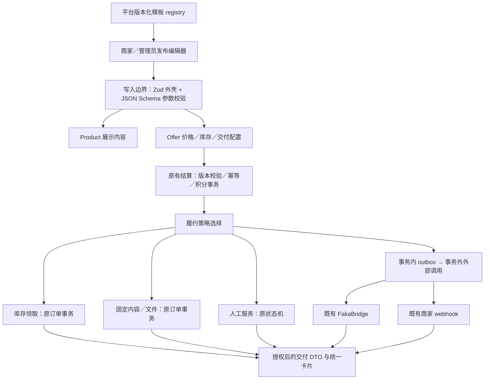

# MoNexus 商品内容、发布与交付规格

| 项目 | 值 |
|---|---|
| ID | SPEC-PRODUCT-COMMERCE-002 |
| 规格版本 | 1.0.0（文档版本，不是应用发行版本） |
| 日期 | 2026-09-09 |
| 状态 | Ready for implementation review；业务决定已确认，实现尚未开始 |
| 代码基线 | `develop@ba32e0594babdbf196db19bae1a972a451fe3bb1` |
| 实施方式 | **一个实施 agent，顺序完成前后端，独立 worktree** |
| 配套 | [实施计划](plan.md) · [七套模板规范](templates.json) · [页面原型](ui-preview.html) |

## 1. 目标与效力

本轮把现有数字商品平台整理为具有明确商品信息、可维护模板、完整发布流程、可信身份、可控分享和一致交付体验的商城。保留 `Product`（SPU）、`Offer`（SKU）、库存、订单、交付物和结算现有骨架。

本规格是本轮新增行为的权威。未明确修改的资金、库存、文件、Xboard 协议和历史订单规则继续适用。历史计划中的多人并行、逐 AC 新增 E2E、每次全量等执行要求不适用于本轮；遵循 [测试政策](../../testing-policy.md) 和 [Git 规范](../../branching-and-ci.md)。若新代码基线改变相关契约，先记录具体差异并修订本文，不能直接照抄旧行号。

### 1.1 用户已经确定的业务决定

1. 覆盖七种数字商品形态；用统一 SPU/SKU、版本化 JSON Schema 发布模板、策略式履约组织代码。
2. 分享仅复制链接与文字，不做分享卡片、二维码、原生分享菜单或社交平台 SDK。
3. 短链由独立部署的 [amo0114/shortlink](https://github.com/amo0114/shortlink) 提供；本轮不修改其仓库。
4. 商品可选择游客可见或仅登录可见；Xboard 导入默认仅登录可见。
5. 平台自营表示经营归属；平台保障由管理员授予/撤销，商家可按商品申请；平台合作伙伴保持原有独立语义。
6. 平台保障只承诺“平台协助售后与争议处理，不另作先行垫付承诺”。
7. Xboard 介绍在本地可视化编辑；上游变化由管理员预览、手动采纳，日常同步不覆盖。
8. 应用版本只在管理员界面展示，使用规范 SemVer 和实际构建来源。
9. 实施固定为单 agent；完成后由 Owner 交回主代理 review，不能自行合并或部署。

### 1.2 本轮落实与边界

| 主题 | 本轮交付 | 不在本轮实现的独立业务 |
|---|---|---|
| 卡密 | 独立卡池、结构化字段、规格与说明模板 | 自建许可证生成/验证/设备激活计费服务 |
| 账号 | 独享账号池；共享账号的固定内容交付；明确使用条款 | 席位租赁、并发设备控制、自动轮换密码、内嵌 TOTP |
| 文件 | 固定文件与人工回执，沿用订单授权和短时签名 | 实际下载次数硬限制、买家附件、DRM/流媒体 |
| 订阅 | 当前有效期、手动续费、Xboard/FakaBridge 与现有 webhook | 自动扣款、通用面板插件市场、新面板驱动 |
| 人工服务 | 资料收集、进度、附件交付、验收、争议 | 聊天/客服工单系统、阶段分款 |
| 预约 | 期望服务日期、商家接单确认、既有提醒 | 精确时段库存、Redis 预占、核销码、日历同步 |
| 交易 | 一单购买一个套餐销售单位，复用现有结算 | 购物车、多件并发出库、批发阶梯价、实物物流 |

“共享账号”首版意为同一交付内容可售给多人，平台不宣称控制其同时在线人数。“预约”首版意为日期申请，不能显示虚假的剩余时段或承诺自动占位。上述独立业务不是以 TODO 藏在当前验收中的任务；未来有真实需求再分别设计其并发与资金规则。

### 1.3 已有能力与本轮缺口

| 现有锚点（相对仓库根） | 核实事实 | 本轮动作 |
|---|---|---|
| `server/prisma/schema.prisma` Product / Offer | Offer 是商业、库存和履约真相源；Product 有兼容投影 | 只增量扩展内容与模板，不重建 SPU/SKU |
| `server/src/lib/deliveryFields.ts` | 已有结构化库存与交付字段 | 接入模板，修正共享账号的固定交付限制 |
| `server/src/modules/orders/fileAccess.ts:65` | 已有订单权限、审计、频控和 presign | 复用，不新增 download_tokens |
| `server/src/modules/merchant/service.ts:1146` | 已有人工附件和交付动作 | 统一交付 UI；补平台经营者入口 |
| `server/src/modules/orders/service.ts:605` | Xboard/webhook outbox 在订单事务内创建 | 保留原认领、幂等、重试与补偿机制 |
| `src/pages/ProductDetailPage.tsx:711` | 商家卡静态显示认证/保障文字 | 改读权威身份与保障投影 |
| `src/components/merchant/MerchantProductFormModal.tsx:492` | HTML textarea 标注 Markdown，无对应解析 | 可视化编辑与统一净化契约 |
| `server/src/modules/catalog/fakaSync.ts:525` | 同步更新 sourceHash，但不更新本地介绍 | 分离介绍观察记录与本地编辑版本 |
| `src/App.tsx:31` / `src/pages/LoginPage.tsx:151` | 商城整体登录保护，登录固定回首页 | 按商品可见性与安全 returnTo 接线 |
| `server/src/modules/products/cache.ts:86` | 缓存没有 audience 维度 | 隔离游客/会员并重新检查当前可见性 |
| `server/src/modules/admin/offerAdmin.ts:15` | 普通管理员套餐只支持有限 patch | 补齐平台套餐管理，不借用 merchant API |
| `server/prisma/schema.prisma:1037` | DeliveryFile 必须有 merchantId | 支持平台文件归属，保留商家隔离 |

## 2. 架构与不变量



- 类别只负责目录；模板负责参数与编辑引导；策略只由合法的 Offer 配置选择。三者不得共用一个枚举代替。
- 七种商品模板不等于七个 handler。卡密/独享账号复用库存策略，文件/固定内容/共享账号复用固定策略。
- 不增加事件总线、通用插件容器或运行时代码加载。使用有限 discriminated union 与穷尽分支/静态策略表即可体现 Strategy Pattern。
- 扣/冻积分、库存领取、Order、DeliveryRecord、PointLog、Settlement 和 outbox 的原子边界不动。
- 外部 HTTP 不进入订单事务；不能将“支付完成后回调”取代即时库存的同事务交付。
- 保留 `FOR UPDATE SKIP LOCKED`、余额条件更新、Offer 锁后重验、任务租约与结果 CAS。
- 商品可见性控制购前内容；订单交付仍按订单归属和状态授权。商品下架或改可见性不删除已购记录。
- 不记录秘密库存、密码、订阅 token、签名 URL 或买家答案到商品属性、分享、AdminLog、指标。

## 3. 数据模型增量

字段名与 JSON 语义在本规格中冻结；Prisma 关系名可合理选择。时间均为 UTC ISO-8601；预约日期继续使用既有业务时区日历日期语义；积分继续为现有正整数，禁止浮点金额。

### 3.1 Product

| 字段 | 类型与默认 | 说明 |
|---|---|---|
| `templateKey` | nullable String | 七种 key；null 为存量未分类商品或有限兼容窗口旧请求创建的草稿 |
| `templateVersion` | nullable Int | 与 key 同时为空或同时非空；首版 1 |
| `attributes` | Json，默认 `{}` | 对应 productSchema 的公开参数；无秘密信息 |
| `details` | Json，默认空结构 | 下方 ProductDetails；不能放库存或购买资料答案 |
| `visibility` | `public` / `members_only`，默认后者 | 与 draft/active/inactive/archived 独立 |
| `contentVersion` | Int，默认 1 | 内容编辑 CAS 与购前说明确认版本；每次内容写入加 1 |

继续使用 `name/description/richDescription/images/imageUrl/categoryId/type`，不再创建同义的 title/summary/cover/content 列。沿用 `products/schema.ts` 的既有上限：名称 120、简介 2,000、图文 20,000 UTF-16 code units；简介 UI 建议 40–140 字。ProductDetails 的字符串也按 UTF-16 长度计数；JSON Schema 的 minLength/maxLength 遵循标准按 Unicode code point 计数，前端相应计数器必须一致。服务端 JSON 请求体维持既有限制，不为本功能放宽全站限制。

```ts
type ProductDetails = {
  highlights: string[];       // 0..4 项，每项 1..40
  usageInstructions: string; // 0..4000，纯文本，保留换行
  purchaseNotes: string;     // 0..2000，纯文本
  afterSalesInstructions: string; // 0..2000，商家说明，不能覆盖平台规则
  faq: Array<{ question: string; answer: string }>;
  // 0..8 项；question 1..100，answer 1..1000；保持输入顺序
};
```

空结构为 `{"highlights":[],"usageInstructions":"","purchaseNotes":"","afterSalesInstructions":"","faq":[]}`。这不是任意 block editor；必需区域由统一页面组成，不能拖入脚本或未知 block。

`contentVersion` 覆盖模板、attributes、details、名称、简介、图文、图集、分类、visibility、purchaseForm 的变化。普通 Offer 的名称、价格、商业配置仍由现有 checkoutVersion 负责；本轮新增 Offer.attributes 也纳入该版本。库存销量变化不修改 contentVersion。

### 3.2 Offer

新增 `attributes Json default {}`，按所在 Product 的 offerSchema 校验，用于套餐特有的公开规格。模板 key/version 从 Product 取得，不在每个 Offer 重复存储。容量、价格、有效期、文件、deliveryFields、autoProvision、externalIntegration 等继续使用现有强类型字段，不复制进 attributes。

一商品最多 20 个套餐（含默认套餐）；至少保留一个默认套餐。默认、显示顺序和最低可售价仍是不同概念。现有超过上限的异常数据只读列出，不静默删除。

### 3.3 Order

新增 nullable `productContentSnapshot Json`：

```ts
type ProductContentSnapshot = {
  version: 1;
  contentVersion: number;
  templateKey: TemplateKey | null;
  templateVersion: number | null;
  productAttributes: Record<string, string | number | boolean | string[]>;
  offerAttributes: Record<string, string | number | boolean | string[]>;
  details: ProductDetails;
  assurance: null | {
    grantId: number;
    policyCode: 'platform_assistance_v1';
    policyText: string;
    validUntil: string;
  };
};
```

只在创建订单的原事务内冻结。无需复制整份营销 HTML/图集，已有商品名/封面与 Offer/表单/交付快照继续使用。历史订单该列为 null，UI 不把当前商品条款补作历史承诺。

报价增加 `expectedProductContentVersion` 和 `expectedAssuranceGrantId`（无保障显式 null）；新客户端确认时必传。服务端事务内重验内容版本和当前有效 grant，变化返回原有 `409 CHECKOUT_CHANGED`，不能静默按新条款成交。这两个值在显式传入时加入原 `computeRequestDigest` canonical 对象；两个新字段均省略时，旧请求摘要字节结果保持不变。保留原 completed 重放逻辑，不新增指纹版本表，不重新执行已完成订单。新请求两个字段必须同时出现；有限旧客户端窗口允许同时省略，并按旧协议成交、快照实际条款，窗口结束后新下单必传（已完成旧请求仍可重放）。

Wire contract：沿用认证 `GET /api/checkout/preview?productId=42&offerId=7`，查询参数不变，既有响应顶层新增 `productContentVersion:number`、`assuranceGrantId:number|null` 和 `productContentSnapshot:ProductContentSnapshot`（只作待确认预览，version/contentVersion 与前两字段一致）。`POST /api/orders` 既有 body 顶层新增 `expectedProductContentVersion`（正整数）及 `expectedAssuranceGrantId`（正整数或 null），从预览同名来源映射，沿用 Idempotency-Key 和其他确认字段。只传一个或类型错误返回既有 `400 VALIDATION_ERROR`；不从 body 中接收 snapshot 或保障文案。预览读取采用一致的短事务视图，最终创建仍重新加锁核验；预览没有锁定库存或保障。订单创建响应形状不另改，授权后的订单详情增加 productContentSnapshot。

结算在原事务取得 Product 行锁后读取内容和有效 grant，随后取得原 Offer 锁并重验配置再冻结快照；内容、保障、发布/归档及会同时修改 Product/Offer 的写路径统一 Product → Offer（多套餐按 ID 升序）顺序，禁止反向嵌套。原续费 Order 锁保持其既有位置，不让内容/保障写路径反向获取 Order 锁。保障有效时间在取得锁后由数据库当前时钟取值，作为本次条款判断点；不能使用等待锁前的时间认定已过期保障仍有效。

### 3.4 平台文件归属

将 `DeliveryFile.merchantId` 改为 nullable；新增 nullable `uploadedByUserId` FK（删除用户 RESTRICT），只记录本轮起可确认的真实上传 actor。既有记录不把 Merchant.userId 冒充实际上传者，历史未知保持 null。新增 CHECK：merchantId 非空或 uploadedByUserId 非空，保证平台文件必须有 actor；所有新上传（含商家）都在写入边界填当前操作者，平台上传必须管理员且 merchantId=null。关联 `merchant` 改为 optional，旧商家行不改变归属。

- 商家 Offer/人工附件只能引用自己的 active 文件；null merchantId 不是商家通配符。
- 平台 Offer/平台人工订单只引用 merchantId=null 的 active 文件；管理员代审商家文件不等于可把它绑定为平台文件。
- 平台文件由全部有效管理员共同管理，不绑定到某管理员个人经营；actor 仅作审计。
- 复用当前流式上传、StoredObject 登记、同 key 锁、GC、私有 provider 与订单下载授权。
- 平台上传进入现有同一 `/api/uploads/delivery-file` 服务；按角色选择归属，管理员分支必须 MFA。请求不接受 merchantId/userId。

## 4. 动态 JSON Schema 模板

### 4.1 单一来源

[templates.json](templates.json) 是首版七套模板的冻结机器可读定义。实施时将其内容放到 `server/src/modules/catalog/templates/definitions.json` 并从一个 registry 导出；前端通过 `GET /api/product-templates` 消费。不得同时手写另一份前端字段规则。

每项包含 `key/version/label/productSchema/offerSchema/ui/fulfillmentRules`。两个 schema 使用 JSON Schema 2020-12，字段仅为 string/integer/boolean/有限枚举/string array；所有 object 设置 `additionalProperties:false`，数组与文本均有限长。schema 定义只由代码发布维护；不存在商家上传 schema 或管理员在线 schema 编辑器。

`GET /api/product-templates` 返回 `{registryVersion:1,templates:[...]}`，每项与本 JSON 的 key/version/label/productSchema/offerSchema/ui/fulfillmentRules 一致，不返回 examples（仅文档样例）。前端以 key+version 取 schema；下列别名用于全部 DTO，实际代码复用已有媒体/购买表单/交付类型，不复制同义定义：

```ts
type TemplateKey = 'redemption_code' | 'account' | 'digital_file'
  | 'fixed_content' | 'subscription' | 'manual_service' | 'appointment';
type TemplateAttributes = Record<string, string | number | boolean | string[]>;
type PlatformMediaRef = {kind:'upload';objectKey:string} | {kind:'static';path:string};
type DescriptionImageRef = {src:string;ref:PlatformMediaRef};
```

TemplateAttributes 只是有限 JSON 值的传输类型；具体 key、必填和联合约束必须通过所选 schema 验证。UI 展示枚举采用 registry `ui` 的标签；没有单独标签时沿用 schema title/enum，不能自动翻译成未确认的商品事实。

- 新增 `ajv` 8.x，使用 2020 入口，strict 模式、allErrors=true；关闭 coerceTypes/useDefaults/removeAdditional；锁文件记录实际版本。
- schema 在启动时编译；不接受远程 `$ref`、自定义可执行 keyword、JS 表达式或 URL 指定 schema。
- JSON Schema 的 default 只是注解。本轮默认值由模板选中动作明确写入表单，不让 validator 隐式改请求。
- Zod 校验 API 外壳、角色、既有 Offer/purchaseForm/deliveryFields；Ajv 只校验 attributes。边界校验后转换成明确领域类型，内部不逐层重复解析 unknown。
- 返回的字段错误是 `{path,message}`，path 为 `/attributes/...` 或 `/offers/<index>/attributes/...`；服务端不回显秘密值。
- UI 配置只决定顺序、label、帮助和控件；不是验证依据。必要字段/枚举/上下限由 schema 决定。
- registry 不包含商品内容、上游目录或后台连接参数，可公开缓存；不需要按 audience 拆分。

### 4.2 七种模板与真实履约约束

| key | 公开参数重点 | 配置与发布规则 |
|---|---|---|
| `redemption_code` | 适用产品、地区、兑换说明；套餐单位/面值文字 | 默认独立库存，交付字段建议 code；兑换期限是描述，平台不凭文字自动销毁未售卡 |
| `account` | 适用服务、独享/共享、使用限制；套餐权益 | 独享默认库存；共享允许固定内容；账号/密码等值只进入交付配置 |
| `digital_file` | 内容类型、格式、兼容环境、使用授权；文件版本 | 发布必须 instant_fixed+file，绑定本方文件；展示大小来自文件记录，不能手填伪造 |
| `fixed_content` | 内容类型、适用范围；套餐内容范围 | instant_fixed text/url；每位买家得到同一内容，购前明确交付类型 |
| `subscription` | 服务名称、服务说明；流量/线路等已确认规格 | 复用 validityDays 或外部真实周期；可库存/固定/人工开通；Xboard 强制既有 provider 路径 |
| `manual_service` | 服务范围、产出说明、准备事项；套餐服务内容 | manual_service；purchaseForm 收集资料，按原状态机履约与验收 |
| `appointment` | 服务形式、时区说明、准备事项；套餐服务内容 | manual_service；至少一个 required date 购买字段；沿用最早/最晚天数校验；只表示期望日期 |

表内默认不是隐式切换：选模板时填初始建议，变更模板前预览将清除的参数并确认；保存后由服务端对最终合法组合校验。所有模板都必须尊重已有资金/文件/外部集成约束，不能靠 UI 选择绕过。

以下为新建/补齐模板后的**唯一合法组合矩阵**，优先于上表的概述：

| 模板/属性 | 允许配置 | 附加要求 |
|---|---|---|
| redemption_code | inventory | limited；text；可普通卡密或结构化库存 |
| account，accessModel=exclusive | inventory | limited；text；发布必须有 1..8 个 deliveryFields |
| account，accessModel=shared | fixed_text | 发布必须有 fixedStructuredContent；不使用 Offer.deliveryFields |
| digital_file | fixed_file | 发布必须绑定本方有效私有文件 |
| fixed_content | fixed_text / fixed_url | 无结构化账号值 |
| subscription | inventory / fixed_text / fixed_url / manual / merchant_webhook / faka_bridge | 外部绑定必须 faka_bridge；webhook 只供有有效配置的经营商家 |
| manual_service | manual / merchant_webhook | webhook 沿原 autoProvision 门禁，无人工字段模板 |
| appointment | manual | purchaseForm 至少一项 `type=date,required=true`，按原 min/max 天数规则；不能自动开通 |

configuration 是发布规则标识，不增加数据库枚举：inventory=instant_inventory+text；fixed_text/fixed_url/fixed_file=instant_fixed 对应内容类型；manual=manual_service+text 且无自动/外部开通；merchant_webhook=manual_service+autoProvision；faka_bridge=manual_service+externalIntegration=faka_bridge。除 inventory 强制 limited 外，limited/unlimited 均依原容量规则；无关的 fixedContent/fixedFileId/deliveryFields/外部字段需为其原协议的空值，不接受混合配置。只有 account/shared 支持新 fixedStructuredContent；普通 manual 的结构化人工交付继续复用原协议。空缺必填账号属性可保存草稿，但发布前必须满足矩阵。

矩阵机器映射放入每个模板的 `fulfillmentRules`：数组项 `{whenProductAttributes,configurations,requireStructuredDelivery,requireRequiredDateField}`。条件是指定属性的精确等值匹配，空对象为无条件；不支持表达式。requireStructuredDelivery 为 `none|inventory_fields|fixed_fields`。registry endpoint 同时返回这些字段，前端只据此限制选项；服务端结合既有经营权限和资源状态做最终门禁。草稿条件尚未匹配时允许选项的并集但显示待补齐，不据此判为可发布。

### 4.3 草稿、切换与版本

- 新 v2 草稿必须选模板；唯一例外是 §9.1 有限旧请求兼容生成的 null 模板草稿，按相同 legacy 补齐流程处理，不能直接发布。schema 的 required 参数可暂缺，已填写字段仍做类型、长度、枚举校验。服务端由同一 schema 去除根 required 生成草稿校验器，不维护第二份手写规则。
- 发布执行完整 schema 及业务门禁。active 商品保存必须保持完整有效；不完整修改先下架再保存，不维护第二套影子草稿。
- 只有从未发布且没有订单/库存/外部 link 的草稿可以换模板；其他商品模板锁定，允许修改参数，需换形态时新建商品。
- 存量 templateKey=null 保留现有展示与履约，编辑时提供“补充商品形态”；只能在 inactive/draft、没有未完成外部任务时选择与全部现有 Offer 相容的模板，不清库存、不改履约、不改历史订单。active 存量商品可继续编辑原字段，公开前必须先完成模板补齐。
- schema v1 一旦被商品引用即不可原地改其语义。未来 v2 升级必须显式转换并预览；旧版本定义在仍有引用时保留。

### 4.4 购买资料与结构化交付

购买表单继续使用现有 `Product.purchaseForm` 契约（最多 6 项；text/select/date），与发布属性分开。模板给出建议，商家编辑定义；买家答案只存订单。Xboard 的 email 字段、邮箱验证和 OTP 证明继续锁定既有协议，不能改 key/删除必需项。

结构化库存继续使用 `Offer.deliveryFields`（最多 8 项）和现有导入预览。不改历史分隔/去重语义。共享账号固定交付增加 `Offer.fixedStructuredContent Json?`，格式复用 `StructuredDeliveryContent`，仅 `instant_fixed + text` 合法；固定文本由 fields/values 在边界规范化产生，不能让两份值独立编辑。写入同时维护 fixedContent；交付时冻结到 DeliveryRecord.structuredContent。该新字段永不进入公开 DTO，纳入 checkoutVersion；已售订单不跟随当前账号内容变化。

结构化固定输入必须有 1..8 个 fields，values 使用既有字段值校验；生成文本仍满足既有 fixedContent 5,000 字符上限。请求提供非空 fixedStructuredContent 时 fixedContent 必须显式 null，由服务端生成；Offer.deliveryFields 必须 null，字段定义仅在结构化快照内。编辑省略 fixedStructuredContent 表示不变，此时已有结构化值不得另行写 fixedContent；显式清为 null 时必须同时提交新的纯文本 fixedContent（草稿允许 null），防止旧账号值残留。DB CHECK：fixedStructuredContent 非空则模式为 instant_fixed、类型 text、deliveryFields/fixedFileId 为空且 fixedContent 非空。GET editor 对这类配置返回 fixedContent=null，秘密结构化值只返回有经营权限的编辑者。

购买资料不增加密码、TOTP secret、文件上传控件。商家需买家敏感凭证的场景本轮不提供专用采集功能。账号交付卡可以遮蔽敏感字段并逐项复制，但不自行生成动态 2FA。

## 5. 商品内容与媒体编辑

### 5.1 编辑器

创建和编辑共用一份内容表单及图文组件，管理员/商家使用同一 schema；角色差异由权限 DTO 控制。主流程使用独立页面，移动端不把完整编辑器塞进窄弹窗。

图文采用可视化编辑（Tiptap 3.x core/react + 必要扩展，实施锁定具体补丁版本），存储统一为净化 HTML，**不提供 Markdown/HTML 源码混写模式**。

工具栏固定为：撤销/重做、段落/H2/H3、加粗/斜体、无序/有序列表、引用、链接、插入图片、清除格式。图片支持替换、移除、alt 文本；不提供任意颜色/字体、HTML iframe、视频、表格合并或自由布局。表格型信息使用结构化参数区域。

编辑器按需加载，仅进入编辑页才加载。粘贴外部页面时丢弃样式/脚本/外部图片；不能后台抓取图片。没有内容时详情页不显示空壳“图文介绍”。

### 5.2 存储与安全契约

统一服务端内容净化器用于 merchant create/update、admin create/update、导入与采纳；前端 DOMPurify 作为渲染第二边界。

- 基础标签：p/br/h2/h3/ul/ol/li/strong/em/blockquote/a/img；导入旧 h1/h4 分别规范为 h2/h3，b/i 规范为 strong/em。
- a 仅 https 或安全站内绝对路径（以 `/` 开头但不是 `//`），删除 userinfo、控制字符、javascript/data；固定 rel=noopener noreferrer。无效链接保留文字。
- img 仅平台公共图片，保存前经现有 StoredObject/static asset resolver 核实；alt 最多 200 字符；不接受 style、事件、外部 srcset、data URL 或私有交付文件。
- 新增 `descriptionImages` 写入映射：`Array<{src:string;ref:PlatformMediaRef}>`，最多 12 项。编辑器使用上传返回 URL 作 src、key 作 ref；服务端以 ref 解析并改写为 canonical URL。此映射只在写请求中存在，不作为另一份持久文档。
- 编辑已有正文图片时，未替换的 src 通过同一 resolver 的 legacy 入口核实；无法解析必须说明哪张图需替换，不能静默把整段正文写空。
- 图片正常上传沿用 PNG/JPEG/WebP/GIF、5MB、magic-byte 和归属规则；正文最多 12 张，图集最多沿用现有上限；不得放大到“无限图片”。
- Xboard 原文净化使用基础格式且始终删除远程 img；只有本地编辑上传的图可以保留。
- `richDescription` 空值统一为 null；显式 `""` 清空，字段省略不变。旧纯文本按文本转义，不把 `<...>` 猜成 HTML；历史 richDescription 在只读迁移预检后集中净化。

### 5.3 必填与说明

首次发布需要：有效名称、非空简介、有效封面与分类、完整模板参数、至少一个有效且可售 Offer、非空 purchaseNotes 与 afterSalesInstructions。图文、FAQ、亮点和使用说明可选。预检列出具体未完成字段，点击定位编辑区域。

平台保障不代填商家售后承诺；“概不退款”等商家文字不能改变平台既有退款/争议规则。统一页内附“售后处理以订单及平台规则为准”及现有退款规则链接，不添加不存在的赔付承诺。

## 6. 商品访问与分享

### 6.1 可见性规则

| 访问者/商品 | public active | members_only active | draft/inactive/archived |
|---|---|---|---|
| 游客 | 可浏览，兑换需登录 | 不返回商品内容 | 不返回商品内容 |
| 正常登录用户 | 可浏览/按现有资格兑换 | 可浏览/按现有资格兑换 | 公共 API 404 |
| 本商家/管理员 | 公共 API 同上；管理 API 可编辑其授权资源 | 同左 | 仅相应管理 API 可读 |
| 被封禁/失效身份 | 不取得会员权限，沿用认证错误 | 同左 | 同左 |

Xboard 默认 members_only，管理员可以通过内容编辑显式改为 public。其他新商品也默认 members_only，发布者主动选择开放；批量迁移绝不自动公开存量商品。

创建/编辑 UI 显示“游客可浏览商品信息”和“仅登录后可浏览”，附说明“兑换始终需要登录”。visibility 不是秘密库存访问开关，也不表示特定会员等级或密码访问。

### 6.2 全出口与缓存

对 list/detail/reviews、搜索与分类结果、sponsored/editorial 候选均复用同一个服务端 audience 和当前可见性谓词。存在 token 时先沿用 authenticateIfPresent，再校验当前 active user；无效 token 仍按原认证流程处理，不能静默视为游客。

1. 查询层限制 Product active、非 archived、商家当前有效及 audience 条件；原 SQL 排名候选和最终 ORM 查询都加条件。
2. detail/reviews 游客访问 members_only 返回 `403 PRODUCT_LOGIN_REQUIRED`，body 只含通用登录提示，不含名称/分类/价格/封面/商家/评论。不存在或不可售生命周期返回 404。允许知道“需要登录”，不承诺隐藏商品存在性。
3. 缓存 key 与 cursor filterHash 加 `audience=guest|member`；认证结果不能被缓存代替。跨 audience cursor 返回现有 cursor expired 错误并重置。
4. **缓存命中后仍在发送前做当前可见性检查**：详情/评论按商品一查；列表/推荐按候选 ID 批量查当前 eligibility 并剔除。避免撤销公开、下架或封禁后旧缓存泄漏。分页 cursor 基于扫描位置继续前进，不为补齐一页无限重取。
5. visibility/内容/保障/生命周期写入使 detail/reviews/list 与推荐缓存失效；保留原缓存版本机制。DB 校验失败返回错误，不发送缓存内容作为成功。
6. 所有 audience-sensitive HTTP JSON 响应 `Cache-Control: private, no-store`；不让 CDN 共用登录结果。浏览器 StorePage 模块缓存按 audience 隔离，退出/身份失效清理会员商品缓存；不持久化会员详情到 localStorage。
7. 不生成会员商品的公开 OG 标题、封面、预渲染页面或 sitemap 条目。短链落地在鉴权前使用通用品牌标题。

可见性改变无法收回过去已被合法浏览/复制的内容，也不能使既有公共媒体对象变为私有；秘密文件、账号值从一开始走私有交付。本文不把公共封面 URL 的不可猜测性当作权限。

### 6.3 浏览、登录与回跳

将 `/` 与 `/product/:id` 从全局 ProtectedRoute 移到可匿名浏览的 Layout，个人/订单/商家/管理路由继续受保护。Layout 的个人余额、通知等认证请求只在有效登录时发出。

- public 商品游客 CTA：“登录后兑换”。members_only 详情使用通用锁定页：“登录后查看商品”，不先渲染再遮罩。
- 登录参数 `returnTo` 只接受本轮需要的站内 `/product/<正整数>`，允许一个正整数 `offerId` 查询参数；拒绝 scheme、`//`、反斜杠、控制字符、双重编码路径与外站。
- 登录、注册后的会话建立完成再消费回跳；MFA/邮箱验证等中间步骤保留目标。默认登录仍回 `/`。
- 回跳后重新读取商品/套餐，套餐失效提示重新选择；URL 不携带价格、买家资料、会话或库存秘密。

### 6.4 复制体验与文案

详情标题旁提供次级“分享”按钮，打开小型 popover（手机 bottom sheet）：短链预览、主要按钮“复制链接”、次级按钮“复制分享文案”。不调用 navigator.share。

```text
public 文案：
在 MoNexus 看看「{商品名}」
{已选套餐名} · {当前整数积分} 积分
{短链接}

members_only 文案：
与你分享一件 MoNexus 商品，登录后查看详情。
{短链接}
```

public 文案只在当前已成功读取报价信息时带套餐和积分；未选择套餐时第二行固定“查看商品详情与可选套餐”，不使用可能误导的默认价格。“复制链接”始终只复制 URL。“复制分享文案”复制整个文本；会员商品即使由登录用户分享也默认不带名称/价格。

不写“官方保证、全网最低、限时抢购、永久有效”等无依据营销句。成功 toast 为“链接已复制”或“分享文案已复制”；剪贴板 API 失败时展示可选择文本和“请长按或选中后复制”，不能报成功。

售罄但 active 的商品仍可分享；下架/归档禁止新建/取回分享链接，原链接打开后由商品生命周期返回“商品暂不可用”。恢复上架复用原短链。

### 6.5 MoNexus 分享接口与持久化

`POST /api/products/:id/share-link`：可匿名但必须通过该商品的当前 audience 可见性检查；沿用公共写入频控。请求体为 `{}`，**不接受 originUrl/domain/merchantId**。响应：

```json
{"productId":42,"url":"https://s.example/Ab3x9","reused":true}
```

这是商品级稳定链接，不包含 offerId/分享人标识、不承载邀请奖励。目标 URL 由配置中的 MoNexus canonical origin + `/product/:id` 生成；短链服务不接收商品标题或登录 token，describe 固定“MoNexus 商品分享”。

新增 `ProductShareLink`：productId PK/FK CASCADE、status=`creating|ready|failed`、attemptToken UUID?、leaseUntil Date?、url String?、targetUrl String、createdAt/updatedAt。DB CHECK：ready 必须 url 非空；creating 必须 lease/attempt 非空。禁止将失败占位当可用链接。

创建流程：短事务按 productId insert/CAS 领取 30 秒租约 → **事务外**调用外部创建（含登录与允许的鉴权重试，总超时 8 秒）→ 短事务按 attemptToken CAS 写 ready。并发已有 creating 返回 `409 SHARE_LINK_CREATING`，UI 显示“链接正在准备，请稍后重试”，不持续轮询。ready 校验当前可见性后直接返回；远端调用完成也必须在响应前重新读取当前商品/用户资格，已转会员可见或下架则返回相应403/404，稳定 URL 可存但不得发给当前无权访问者。expired lease 仅用户后续操作可重新领取，没有新增后台重试队列。

网络超时/远端失败写 failed 并返回 `503 SHARE_LINK_UNAVAILABLE`；外部实际成功但响应丢失可能留下孤儿短链，下次显式重试可能生成第二条。承认此限制，数据库只保留一个胜出的 canonical 链接；不声称外部 exactly-once、不做无限重试。即便旧请求迟到 CAS 失败，其链接不得覆盖新 attempt。

短链故障不影响浏览/兑换；没有短链时不偷偷复制主域名长链。服务未配置时分享按钮仍可打开并显示“分享暂未开放”，不对消费者显示 API/key 等运维术语。

### 6.6 shortlink 对接协议

本轮只实现一个明确 provider，不抽多供应商框架。外部项目部署、账号/分组建立和 HTTPS 由 Owner 完成；配置读取服务端环境：

| 配置 | 含义 |
|---|---|
| `SHORTLINK_API_BASE_URL` | HTTPS 网关 origin，不含 endpoint；未配置表示分享未开放 |
| `SHORTLINK_PUBLIC_ORIGIN` | 唯一允许复制的 HTTPS 短域名 origin |
| `SHORTLINK_USERNAME` / `SHORTLINK_PASSWORD` | 专用服务账号，秘密只在服务端环境 |
| `SHORTLINK_GROUP_ID` | 服务账号预先建立的专用分组 |

只用 gateway 的 admin API，不公开调用未保护的 project 内部端口。登录 `POST /api/short-link/admin/v1/user/login`，body `{username,password}`；成功取 data.token；创建 `POST /api/short-link/admin/v1/create`，headers `username` 与 `token`，body：

```json
{"originUrl":"https://shop.example/product/42","gid":"configured-group","createdType":0,"validDateType":0,"validDate":null,"describe":"MoNexus 商品分享"}
```

成功要求 HTTP 2xx、业务 `code="0"`、data.fullShortUrl/originUrl/gid 完整且匹配请求。token 只保存在进程内，首次需要时登录，同进程登录请求合并；401 时丢弃 token，重新登录一次并仅重试一次被鉴权拒绝的创建。其他错误/超时不自动重试创建；登录失败不伪造 token。

响应 fullShortUrl 现有实现可能是 http。解析后必须验证 hostname/显式端口与 SHORTLINK_PUBLIC_ORIGIN 一致、path 为单段字母数字短码（1..64）、无 userinfo/query/hash；然后用配置的 HTTPS origin + 验证后的 path 构造公开 URL。拒绝其它域名/路径，不任意相信返回 URL。部署验收必须证明该 HTTPS URL 真能跳转；代码改协议不能替代 TLS 部署。

OriginUrl 精确匹配请求，gid 匹配配置。禁止通过删除 gateway 鉴权或放开任意目的域名解决接入失败。短链服务的目的域名 allowlist 只需允许 MoNexus canonical origin 对应域名。首次建链会访问目标页获取 favicon；目标页未登录时只能返回通用品牌内容，不能依赖 SSR 商品泄漏。

## 7. 平台身份与保障

### 7.1 模型与权限

`platformOwned` 继续由 merchantId=null 在服务端派生。任何商家 body 中的 official/platformOwned/verified/assuranceGrant 均拒绝，不能静默忽略。平台合作伙伴继续复用 MerchantEntitlement，与保障无自动换算关系。

新增 `ProductAssuranceApplication`：id、productId FK RESTRICT、merchantId FK RESTRICT、reason(20..1000)、status=`pending|approved|rejected|withdrawn`、reviewReason?、reviewedByUserId?、reviewedAt?、createdAt。部分唯一索引：同 productId 只有一条 pending。

新增 `ProductAssuranceGrant`：id、productId FK RESTRICT、applicationId? UNIQUE、status=`active|expired|revoked`、policyCode 固定 `platform_assistance_v1`、validFrom、validUntil、grantedByUserId、grantReason(1..500)、revokedAt?、revokedByUserId?、revokeReason?、createdAt。部分唯一索引限定同 productId 最多一条 status=active；授予前在同事务将已过期旧 grant 标记 expired，不伪造撤销 actor/时间。历史行不删除、不改条款；CHECK validUntil > validFrom，revoked 状态的撤销三字段必须完整，其余状态均为空。

- 有效保障 = 当前 active/未归档商品、经营商家有效（平台自营无商家检查）、grant status=active 且 `validFrom <= now < validUntil`。读 DTO 对超时但尚未更新的 active 行投影为 expired，不在 GET 写库。新授权 validFrom 为事务内当前时刻，不支持未来预约生效。
- 授权最长 365 天、默认表单 90 天，管理员明确确认到期日；到期按读取实时判定，不依赖 cron。
- 只有正常商家可为自己的 active 商品申请；不能申请“平台自营”。pending 可撤回；rejected/withdrawn 后可重新申请。有效 grant 期间不创建重复申请。
- 管理员可直接授予有效商品（包括平台商品），也可批准/拒绝申请、撤销 grant。批准同时创建 grant、修改申请与写 AdminLog；撤销也在同事务审计。
- 已有 pending 申请时直接授予返回 ASSURANCE_ALREADY_PENDING，引导审核该申请，不遗留一条永久无法批准的申请；商家申请/管理员直接授予都在同一 Product 锁内检查。
- 审核、grant 和商品发布/归档竞争使用同一 Product 行锁 + pending CAS；重复审核返回 409，零第二授权。
- 不能把 expired 状态依靠定时 job 当作授权判断。grant ID 纳入结算时的当前条款比较。
- 硬删除商品时，存在申请/授权历史按既有“保历史则归档”处理，不能级联删除保障审计。

### 7.2 API 与投影

| API | 请求/返回要点 |
|---|---|
| `GET /api/merchant/products/:id/assurance` | `{application:ApplicationDto|null,grant:GrantDto|null}`，仅自己 |
| `POST /api/merchant/products/:id/assurance/applications` | `{reason}` → 201 ApplicationDto |
| `POST /api/merchant/assurance-applications/:id/withdraw` | `{}` → 200 当前申请 |
| `GET /api/admin/assurance-applications?status=pending&page=1&pageSize=20` | `{items,total,page,pageSize}`，最大 100 |
| `POST /api/admin/assurance-applications/:id/approve` | `{validUntil,reason}` → `{application,grant}` |
| `POST /api/admin/assurance-applications/:id/reject` | `{reason}` → ApplicationDto |
| `POST /api/admin/products/:id/assurance/grants` | `{validUntil,reason}` → 201 GrantDto |
| `POST /api/admin/assurance-grants/:id/revoke` | `{reason}` → GrantDto；已撤销返回既有终态不重复审计 |

ApplicationDto 返回上述申请字段（商家读不回审核管理员 ID）；GrantDto 对商家只回 id/status/policyCode/validFrom/validUntil/revokedAt/公开政策，内部 grant/revoke 原因只 admin。reason 审核/拒绝/撤销统一 1..500 字符，申请 reason 20..1000；validUntil 必须在当前时刻后且不超过 365 天。撤销已自然到期的记录返回 expired，不新增撤销审计。所有管理员接口复用 admin+active+MFA。

公共 Product DTO 新增 `assurance: null | {label:"平台保障",policyCode:"platform_assistance_v1",policyText:string,validUntil:string}`；不返回申请、内部理由、管理员信息。固定 policyText 为用户已确认的完整一句承诺。

### 7.3 页面

商品详情“提供方与服务”显示经营者、平台自营/合作伙伴身份及有效保障。保障说明通过展开内容可读，不仅藏在 hover tooltip；移动端点击可展开。没有授权就没有保障徽标；商家通过入驻审核不自动叫“平台认证商家”。

商家商品编辑页最后一节显示申请状态、提交/撤回入口；不能用 checkbox 授权。管理员商品管理提供保障筛选、申请列表、授予/撤销弹窗和审计记录。平台自营同样不自动带保障，保持经营身份与承诺分开。

## 8. Xboard 内容适配与编辑

### 8.1 字段归属

| 数据 | 权威来源 | 本地编辑 |
|---|---|---|
| provider/planId/externalSku、可售状态与容量 | 现有 FakaBridge 规范化目录/身份映射 | 保持专用 preview/confirm/rebind 流程，普通文本框不可写 |
| pointsPrice、名称、分类、封面、排序、visibility | MoNexus | 允许；默认 members_only |
| 真实周期、上游容量/明确返回的技术参数 | 上游 | 只读来源卡；不得从营销 HTML 推算额度/周期 |
| 简介/图文/details/本地参数说明 | MoNexus | 可视化编辑；上游变化只提示 |
| 库存秘密、订阅结果、token、买家邮箱 | 订单/外部交付协议 | 不进入商品正文或源介绍快照 |

Xboard 使用 `templateKey=subscription,templateVersion=1`。导入只根据已提供字段形成可读简介和基础正文；未知流量/带宽/设备数显示“未提供”或省略，不填 0/不限。不能抓取上游任意图片或用 AI 补造套餐事实。

### 8.2 源介绍追踪

在 ExternalCatalogLink 增加：`latestDescriptionHash String?`、`latestDescriptionHtml String?`（净化后）、`latestDescriptionText String?`、`descriptionCheckedAt DateTime?`、`acceptedDescriptionHash String?`。继续保留 sourceSnapshot 的原有“无 HTML”元数据契约；源介绍专用列不进入公共 DTO。

介绍 hash 为 SHA-256(UTF-8 净化后的 HTML，空为 `""`)。它与现有 sourceHash 独立：容量/SKU 同步成功不能把介绍标记为已采纳。

- 首次导入：净化源 HTML/摘要，写 Product 与 latest/accepted hash；仍保存 draft，不自动发布。
- 现有增量同步确认可以更新 latest 观察记录和 checkedAt，不能更新 Product 文案或 accepted hash。
- 新增 `POST /api/admin/products/:id/source-description/preview`：事务外重取原 provider 目录，规范化并仅返回 `{sourceHash,descriptionHash,source:{description,richDescription},local:{description,richDescription,contentVersion},changedSinceAccepted}`；**不写 Product/审计/观察记录**。
- 新增 `POST /api/admin/products/:id/source-description/apply`：`{sourceHash,descriptionHash,expectedContentVersion,fields:["description"|"richDescription"]}`，fields 非空且去重。重新获取 source，核对两个 hash；事务内锁 Product 并 CAS contentVersion，覆盖仅被选中的两字段，写最新观察与 accepted hash、更新 contentVersion、写 AdminLog（字段名/hash，不写全文）。
- 远端变化返回 `409 FAKA_SOURCE_CHANGED`；本地编辑变化返回 `409 PRODUCT_CONTENT_CHANGED`，保留本地未保存输入并要求重新预览。外部失败返回现有脱敏 provider 错误，不把空介绍当成功。
- 只采纳简介时 accepted hash 表示“管理员已处理这次源介绍”，不是本地全文相等；管理 UI 同时显示“本地内容可能与上游不同”。修改本地正文不改变 accepted hash。
- apply 不改图片/分类/details/自定义属性、积分价、SKU、表单或 visibility。不增加逐字符自动合并或自动覆盖模式。
- 存量 imported 商品的这些新列全部 null；第一次预览只比较本地/当前源，不宣称已经同步，管理员选择后再落 accepted hash。

### 8.3 编辑布局

“订阅参数与来源”区域分本地可编辑字段和来源只读摘要；正常页面只用套餐名称/周期/更新时间，planId/SKU/hash 放折叠技术信息。正文使用与普通商品同一图文编辑器。

“检查上游介绍”打开双栏对比，手机切换“当前内容／上游内容”；分别勾选采纳简介和正文，默认不勾选，按钮准确显示“替换已选内容”。有未保存本地输入时先保存或明确放弃再检查/采纳，不用服务器旧值覆盖当前编辑区。

## 9. 写入 API、后台操作与履约策略

### 9.1 创建请求（现有端点升级）

仍使用 `POST /api/merchant/products`、`POST /api/admin/products`。新 DTO 有显式 `editorVersion:2`，先在边界转成同一个 CreateProductCommand，不把前后端表单字段直接 spread 到 Prisma。

```ts
type CreateProductV2 = {
  editorVersion: 2;
  templateKey: TemplateKey;
  templateVersion: 1;
  name: string;
  categoryId: number;
  description: string;
  richDescription: string | null;
  descriptionImages: DescriptionImageRef[];
  images: PlatformMediaRef[];
  visibility: 'public' | 'members_only';
  attributes: TemplateAttributes;
  details: ProductDetails;
  purchaseForm: PurchaseFormField[];
  offers: DraftOfferV2[]; // 1..20，首项是默认套餐
};
type DraftOfferV2 = {
  name: string; price: number; originalPrice: number | null;
  attributes: TemplateAttributes;
  deliveryMode: 'instant_inventory' | 'instant_fixed' | 'manual_service';
  stockMode: 'limited' | 'unlimited';
  validityDays: number | null;
  fixedContentType: 'text' | 'url' | 'file';
  fixedContent: string | null;
  fixedFileId: number | null;
  fixedStructuredContent: StructuredDeliveryContent | null;
  deliveryFields: DeliveryField[] | null;
  autoProvision: boolean;
};
```

无外部集成字段、stock、isHot、merchantId、status、platformOwned、assurance。外部套餐只由 Xboard 导入/绑定流程创建；create 普通 Offer 为 active，limited stock=0，sortOrder 按数组顺序，文件或固定内容在草稿中可空但不能发布。

categoryId 继续由分类 resolver 验证并填兼容 type 快照，不能从 templateKey 推导 type；images 首项产生 imageUrl 投影。现有 Offer 字段限制继续复用：name 1..50、price 正整数且不超过 2,000,000,000、originalPrice 为 null 或不低于 price、validityDays 为 null 或 1..3650。autoProvision 必须满足既有有效 webhook 与商家归属门禁；平台无该配置时不可勾选。

响应 201：`{id,status:"draft",contentVersion,offers:[{id,name,isDefault}],nextStep:"availability"}`。商品与全部套餐同事务；媒体解析在写入前完成，关联资源在事务内核实仍可用；失败不留下半个商品。

兼容仅针对实际旧前端：无 editorVersion 的原有 create DTO 在一个发布窗口内继续映射为旧形态 draft（template=null、members_only）。新 UI 禁止使用它；后续第一次常规发行前确认旧 UI 入口均已替换后移除该 create 分支，旧请求改报 `400 PRODUCT_EDITOR_UPGRADE_REQUIRED`。旧订单/商品读取兼容长期保留，不等于保留旧写入口。

### 9.2 内容与套餐编辑

新增 `PATCH /api/{merchant|admin}/products/:id/content`，body 为 CreateProductV2 的内容字段子集 + 必填 `expectedContentVersion`；不接受 offers/editorVersion/商业字段。每个出现的 attributes/details/purchaseForm/images 都是**整体替换**，省略不变；null 只允许 richDescription，不使用 null 隐式清空其他 JSON。事务内 `contentVersion` CAS，成功返回 `{id,contentVersion,updatedFields}`，冲突 409。

新增认证 `GET /api/{merchant|admin}/products/:id/editor`：返回完整可编辑内容、套餐、当前 contentVersion、模板 registry key/version、有效权限、来源摘要及发布问题。公共详情不能代替管理编辑 DTO；merchant 归属错误 404。

响应外壳固定为 `{product,offers,capabilities,sourceDescription,publicationIssues}`：

- product：id/status/merchantId/contentVersion，加创建 DTO 的内容字段（不含 editorVersion/offers）；存量 templateKey/templateVersion 可 null。图集返回 `{url,ref:PlatformMediaRef|null}[]`，正文映射沿 §5.2；无法解析的历史图 ref=null，编辑器提示替换，不构造假 key。写请求 images 仍仅为 refs。
- offers：现有授权套餐编辑 DTO + attributes/fixedStructuredContent/checkoutVersion；补齐 id/isDefault/status/sortOrder。只有实际经营者（自己的商家商品或管理员平台商品）收到固定交付秘密。管理员查看商家商品保留其既有治理白名单，返回敏感字段为缺省且不可编辑，不能用 null 覆盖它们。
- capabilities：`{editContent,manageOffers,manageAvailability,manageAssurance,applyAssurance,adoptSourceDescription}`，均 boolean；同时约束页面动作，服务端每次写入仍重验权限。manageOffers=false 时既有治理字段按既有管理入口处理，不开放完整套餐表单。
- sourceDescription：非 Xboard 为 null；否则 `{checkedAt,changedSinceAccepted,hasAcceptedVersion}`（时间可 null，未观察时 changedSinceAccepted 为 null）；不在初次 editor GET 发网络请求。完整上游正文只由专用 preview 返回。
- publicationIssues：复用现有 readiness issue 的 code/message，增加可选 `path`（如 `/details/purchaseNotes`）；可定位字段，不能暴露秘密值。

公共商品 list 保留现有摘要字段并增加 templateKey/templateVersion/visibility/assurance；detail 额外返回 attributes/details/contentVersion、各 Offer.attributes。richDescription 仍只在详情出现；descriptionImages refs、fixedStructuredContent、固定秘密、源介绍快照和编辑权限均不进入公共响应。公开参数展示只读取 registry 中定义的属性，存量 `{}` 不补造模板数据。

普通商家 Offer CRUD 继续使用现有端点，增加 attributes/fixedStructuredContent。平台新增 `POST /api/admin/products/:id/offers`；扩展既有 `PATCH /api/admin/products/:id/offers/:offerId` 为完整普通 Offer 编辑，明确只允许 merchantId=null 的平台商品。既有管理员对商家套餐的有限价格等治理能力仍走其既有白名单，不能借新增接口获得商家秘密内容。

编辑 Offer 的 deliveryMode/fixedContentType/外部路径属于履约身份：有订单/库存/未完成任务时禁止换交付策略，需新建套餐、停用旧套餐；普通名称/价/说明等可改，旧订单不变。现有 archive/restore/default/删除约束继续保留；不新增以删除规避历史约束的路径。

套餐新增属性/固定结构化内容进入原 computeOfferCheckoutVersion；额外 `expectedCheckoutVersion` 用于 Offer 修改 CAS（由 editor DTO 提供），冲突报 `409 OFFER_CHANGED`。库存等独立接口不得把该版本冲突当超卖保护的替代。

现有 product-level PUT 的商业兼容投影在窗口内保留；新 UI 所有商业修改只走 Offer。兼容内容写入必须经过同一清洗与 contentVersion 增加，不能保留未清洗商家路径。

### 9.3 平台人工履约

管理员平台商品也必须可完成交付，不能只允许创建 manual_service 然后无人能发货。新增：

| API | body | 行为 |
|---|---|---|
| `POST /api/admin/orders/:id/start-fulfillment` | `{}` | 仅平台订单 pending→processing |
| `POST /api/admin/orders/:id/progress` | `{publicNote}` | 仅 processing；沿用原进度长度/频控 |
| `POST /api/admin/orders/:id/deliver` | `{content?,structuredValues?,attachmentFileId?,publicNote?}` | 同商家交付校验；只能使用平台文件 |
| `POST /api/admin/orders/:id/reject` | `{reason}` | 与商家拒单相同允许状态/积分返还，actor 为 admin |

复用现有领域转换、附件验证和 availableActions，不伪装 merchant 身份。平台 Xboard/webhook 任务处理中遵守原任务接管/取消规则；禁止绕过既有 Xboard 禁止人工替代的约束。商家订单仍走原管理员仲裁，不通过上述平台经营入口处理。

### 9.4 策略边界

新增纯 `resolveFulfillmentStrategy(offer)` 返回：

```ts
type FulfillmentStrategy =
  | { kind: 'inventory' }
  | { kind: 'fixed_text' }
  | { kind: 'fixed_file' }
  | { kind: 'manual' }
  | { kind: 'merchant_webhook' }
  | { kind: 'faka_bridge' };
```

按 externalIntegration/autoProvision/模式/文件判别合法组合；冲突显式拒绝，不能返回一个默认策略兜底。没有新字段持久化 strategy，避免与 Offer 配置漂移。

orders 模块仍编排交易；策略提取只包装已有分支为明确函数，接收现有 tx/已校验配置。文件/库存 handler 不另开事务；外部 handler 的“创建任务”在 tx 内，“执行任务”使用原 worker。纯重构与业务新增分开提交，先以原行为测试证明等价。

交付前端复用同一 `DeliveryContent` 组件从**订单 DTO**选择结构化字段、文本、链接、文件、订阅与进度呈现；不得读取当前 Product 属性来重新解释旧订单。字段显示/复制、到期遮蔽、退款/争议下载禁止均由授权后响应决定。暂不重写整个 Order wire DTO，也不新增另一份交付秘密数组。

## 10. 商品详情与后台响应式设计

### 10.1 视觉原则与布局

沿用当前 `src/index.css` 的中性色表面、靛蓝交互、绿色积分与既有主题。早期 MASTER.md 的未来感字体/重装饰描述不覆盖当前实现。中文正文使用系统 sans-serif，正文 16px，辅助 13–14px，行高 1.6–1.8；标题 24px（手机）/32px（桌面）。

[原型](ui-preview.html) 是信息层级与操作位置参考；本文数值/状态规则优先。原型示例内容不是生产商品，不得直接导入种子数据。

| 宽度 | 详情布局 | 编辑布局 |
|---|---|---|
| 320–767px | 单列；图集→标题简介→套餐价格→提供方→内容；底部固定兑换栏 | 单列分节；顶部进度与底部保存；工具栏横向容纳/换行，无整页横滚 |
| 768–1023px | 内容单列，首屏图集与摘要可两列；不固定右侧购买卡 | 两列只用于短字段，正文全宽 |
| ≥1024px | 最大宽 1200px，主内容+360px 购买卡，间距32px；购买卡 sticky top 与导航错开 | 最大宽1120px，内容+280px 检查摘要；正文编辑宽≥600px |

首屏：面包屑/返回、商品图集（16:10 或原图 contain，已有灯箱与键盘操作保留）、标题、简介、最多4条亮点、身份和分享。购买卡内：套餐选择→所选套餐参数→积分→交付方式/有效期→兑换 CTA。不能用 Product 最低价取代已选 Offer 价格。

正文顺序：商品介绍、参数（商品/所选套餐合并但同名标注来源）、使用说明、购买须知、售后与平台保障、FAQ、评价。空可选区块不渲染；长页在桌面提供粘性锚点导航，手机使用紧凑可横向滚动章节导航，内容本身不得横向溢出。

手机固定底栏只放当前积分与主 CTA，保留 `env(safe-area-inset-bottom)`；正文预留底栏高度。分享在标题旁，不能挤进主兑换按钮。打开弹窗/键盘时不遮挡输入、错误或保存按钮；焦点回到触发位置。

### 10.2 页面状态与文案

| 状态 | 展示与操作 |
|---|---|
| 首次加载 | 尺寸稳定 skeleton；不显示虚假价格/徽标 |
| 需要登录 | 通用锁定页，登录并保留回跳；无商品片段 |
| 商品不存在/下架 | “商品暂不可用”，回商城；不报库存被删除 |
| 无可售套餐 | 仍展示允许浏览的介绍，“暂时售罄”，CTA disabled |
| 余额不足 | 准确显示差额，沿用现有积分/充值可用入口，不强推未开放渠道 |
| 数据请求失败 | 原地重试，不转换为“商品不存在” |
| 已选套餐变化 | 服务端要求重确认时刷新预览，保留非秘密用户输入但重验 |
| 分享失败 | 不影响兑换；可重试复制准备，不伪造成功 |
| 模板未知/存量 | 展示已有简介/图文和合法套餐；不猜类型特有属性 |

### 10.3 发布编辑流程

同一个实施 agent 完成以下共用页面：`/merchant/products/new`、`/merchant/products/:id/edit`、`/admin/products/new`、`/admin/products/:id/edit`；现有入口重定向/接线到这些页面，旧编辑弹窗不再是主要编辑器。

1. 选形态与分类：七模板说明、实际交付差异；分类独立选择。
2. 商品信息：封面/图集、名称简介、模板属性、图文和说明；visibility 显式可见。
3. 套餐：名称、积分、有效期、属性、交付方式与专属配置；多人共享内容有明确提示。
4. 购买资料：现有字段编辑器与模板建议；Xboard 必需邮箱字段锁定。
5. 保存草稿：一次提交商品与套餐；失败保留输入。
6. 可售资源：按已保存 Offer 导入库存/调整名额；文件绑定就绪检查；不把卡密填到商品介绍。
7. 预览与发布：使用同一消费者展示组件的本地 preview DTO，明确“预览”；服务端 readiness 决定能否发布。

编辑已有商品使用同样的分节顺序，不强迫重新走创建向导；顶部显示保存状态、发布状态和返回入口。离开未保存页面提示；不把秘密交付字段存 localStorage 自动草稿。上传失败保留其它输入；图库上传与商品保存分别说明结果。

管理员商品列表增加形态、可见性、保障状态的筛选/摘要，主动作“编辑”，原库存、发布、下架、归档能力保留。手机列表用卡片展示主要状态和更多菜单，触控目标至少44px。

### 10.4 素材与可访问性

本轮不需要 AI 栅格才能完成页面：商品图片由发布者提供，空态/徽标/参数图标复用现有 SVG/Lucide，布局用代码实现。若后续决定增加一张品牌说明插图，按 api-image 技能离线生成并单独审阅，不能让 AI 虚构商品截图、证书或规格；生产文字始终为 HTML。

支持现有所有主题、键盘、读屏 label、可见 focus、reduced-motion；错误关联到字段，不能只变红。手机/桌面分别检查 320/390/768/1024/1440 宽度、长商品名、20套餐、长英文/URL、无图/失败图、200%缩放和软键盘。图像 SafeImage 保留尺寸/alt，懒加载非首屏图；图文编辑依赖不进入商城初始加载。

## 11. 管理员运行版本信息

### 11.1 版本来源

根 `package.json.version` 为唯一应用 SemVer 来源；server/package.json.version 与锁文件根版本发行时同步。**不另建可手填的 SystemConfig 版本号。** 当前 1.0.0 只作源码基线，不倒推出生产已发过 v1.0.0。

- 正式应用版本 `MAJOR.MINOR.PATCH`；破坏已承诺接口/迁移边界升 MAJOR，兼容业务功能升 MINOR，兼容修复升 PATCH。每次进入 master 的运行时代码发行必须按变化类型更新版本；纯文档不要求发版。
- tag 为 `v<package version>`，只对相同 master release commit；CI 拒绝 tag/package 不一致，禁止用日期、随机字符串代替 SemVer。
- develop 构建可在元数据中用 `<base>-dev.<CI run number>+sha.<short>`；本地用 `<base>-dev+sha.<short>`。正式 master 构建的 version 来自发行提交，commit 单独展示；tag 是否存在作为 releaseTag 可空，不能伪造。
- 版本不表示“最新 GitHub 版本”，只表示正在运行的 API 构建；前端/后端镜像同 SHA 部署由原发布流程保障。本功能不提供未核实的前端版本一致性结论。

### 11.2 构建与 API

CI 从根包版本、完整 Git SHA、UTC 构建时间生成 `build-info.json`，写入 API 镜像的非公开目录；前端镜像只写 OCI version/revision 标签，不把版本元数据注入 VITE 环境、public 文件、页脚或健康检查。复用现有 docker-publish 作业，不新增发布流水线。

新增 `GET /api/admin/system/build-info`（admin+active+MFA），`Cache-Control: no-store`：

```json
{"version":"1.2.3","commit":"0123456789abcdef0123456789abcdef01234567","builtAt":"2026-09-09T08:00:00.000Z","environment":"production","releaseTag":"v1.2.3","source":"build_artifact"}
```

上例仅为响应格式。version/commit/builtAt 来自当前镜像中的固定产物，不读当前工作目录 git、不请求 GitHub。产物缺失时这些值为 null、source=`unavailable`；管理员显示“构建信息未提供”，不能用服务器时间或固定1.0.0兜底。生产镜像构建检查必须保证该产物存在；手动老镜像仍能正常运行并如实显示缺失。

入口为管理员“系统设置 → 系统信息”，展示运行版本（API）、环境、短提交（可复制完整值）、构建时间、发行标签（没有则“未记录标签”）。用户/商家不显示入口，直接调用返回403。此需求是权限展示控制，不承诺隐藏公开 Git 仓库或 OCI 标签的版本信息。

## 12. 错误、迁移与发布

### 12.1 新错误码

沿用统一 `{error:{code,message,details?}}`，UI 映射人类提示；不要将上游正文、schema内部关键词或SQL约束名直接显示给商家。

| HTTP / code | 触发 |
|---|---|
| 400 `PRODUCT_TEMPLATE_INVALID` | 未知 key/version、已填 attributes 类型/枚举/长度错 |
| 400 `PRODUCT_EDITOR_UPGRADE_REQUIRED` | 兼容期结束后旧 create DTO |
| 403 `PRODUCT_LOGIN_REQUIRED` | 游客读取会员商品/评论/分享 |
| 409 `PRODUCT_CONTENT_CHANGED` | 内容 CAS 冲突 |
| 409 `OFFER_CHANGED` | 套餐编辑版本冲突 |
| 400 `PRODUCT_TEMPLATE_LOCKED` | 不满足模板切换条件（在售不可补齐、形态一经设定不可更换） |
| 409 `ASSURANCE_ALREADY_PENDING` / `ASSURANCE_ALREADY_ACTIVE` | 重复申请/授权 |
| 409 `ASSURANCE_APPLICATION_CLOSED` | 审核/撤回非 pending |
| 409 `SHARE_LINK_CREATING` | 正在准备稳定短链 |
| 503 `SHARE_LINK_UNAVAILABLE` | 未配置/远端失败/超时/无效响应 |
| 422 `PRODUCT_NOT_READY` | 原有发布错误；新增 details code `TEMPLATE_FIELDS_REQUIRED` / `PURCHASE_NOTES_REQUIRED` / `AFTER_SALES_REQUIRED` / `FULFILLMENT_CONFIG_INVALID` |

保留现有 FAKA_SOURCE_CHANGED/CHECKOUT_CHANGED/FIELD_NOT_WRITABLE/库存/文件错误。不存在、跨商家访问按原404约定，不另造一批同义错误。

### 12.2 迁移顺序

1. 在可丢弃升级库只读统计：各交付组合、无默认 Offer、图片不可解析、旧正文类型、潜在不安全HTML、Xboard link、文件归属、开放订单及未完成任务；不导出秘密库存/买家答案到报告。
2. 增量 schema：Product/Offer 内容字段、Order nullable snapshot、共享固定结构化字段、源介绍列、保障与短链表、平台文件归属。旧迁移不改写，只加新迁移与明确 CHECK/FK/索引。
3. 所有存量 Product.visibility=members_only；template=null，attributes/details 用定义的空值；新内容版本=1。不依据“共享账号”等分类字样猜履约形态。
4. 仅有合法 ExternalCatalogLink 且全部对应 Offer 为 FakaBridge 的商品，可回填 subscription/v1 与从确切本地/源元数据取得的已知参数；缺失 required 参数留待编辑，既有 active 不因此自动下架。
5. 历史订单 snapshot 保持 null；不补造保障、不更新已成交固定内容/文件引用。旧合作权益不转换成保障。
6. 历史富文本净化是一次受控数据迁移：预检数量/差异摘要，保留数据库备份；不能在普通 GET 时悄悄写库。纯 description 不当作HTML迁移。无法自动判断的旧正文保持读取转义/净化并列入修复，不删除商品。
7. DeliveryFile 保留未知的历史上传 actor 为 null，核对商家文件归属与 provider 未变、平台归属 CHECK 已就绪，再允许平台新上传。
8. 公开读权限补齐必须与打开游客商城在同一发行窗口上线；不能先开放页面后补 API 过滤。服务器先支持新 DTO，再部署前端；旧 UI 在有限兼容期仅能生成会员草稿。

legacy active 商品保持原在售状态与历史交付行为；旧模板为空时显示明确待补齐状态。第一次切为 public、首次重新发布或转入完整模板均需满足新字段门禁；不能为了 migration 自动填虚假参数/售后条款。

### 12.3 回退与外部依赖

迁移采用增量结构，回退不 drop 新表/列。含新共享结构化固定交付、平台文件或新订单条款的订单产生后，不回退到不理解这些字段的旧 API；使用修复前进，必要时先通过现有下架/停售操作暂停对应商品。不能仅回退前端后让旧商品级写路径覆盖新内容。

短链真实连通验收依赖 Owner 部署、专用账号、gid、HTTPS与目的域名配置。没有外部环境时本地可完成协议测试与UI，但最终标记“外部联调未执行”，不声称生产分享已就绪；其余商品链路不被这项依赖阻断。生产发布仍走现有 master/release/tag/审批流程，本轮文档和实施 agent 均不自行发布。

## 13. 验收与停止条件

每阶段开始验证先说明风险和选择的检查，复用既有测试入口。下表按独立风险验收，不要求每行一个新测试文件或一个E2E。

| ID | 可观察结果 | 最低有效证据 |
|---|---|---|
| AC-01 | 七模板的必填、非法字段、草稿/发布行为一致；默认值不隐式填充 | registry/Ajv 单元与写入集成 |
| AC-02 | 创建商品与1..20套餐原子保存；发布/库存分离 | 既有 catalog lifecycle 集成 |
| AC-03 | 商品内容、套餐、保障变化要求重新确认；旧订单条款不变 | checkout/订单集成与并发 |
| AC-04 | 商家与管理员都能编辑/发布七种合法配置；平台文件和人工订单可交付 | 受影响路由集成 + 模板表单组件 |
| AC-05 | 商家不能授权背书、越权文件或修改 Xboard 身份；并发审核最多一grant | 权限/真实PG并发 |
| AC-06 | 所有公开出口过滤会员商品，缓存命中与退出后不泄漏 | products/reviews/merchandising 集成 + Store 缓存单元 |
| AC-07 | public游客浏览→登录→原商品/套餐→标准兑换 | 在既有 catalog/checkout E2E 增加一条旅程 |
| AC-08 | members_only短链只显示通用登录页；分享文案无商品内容 | 分享API/组件；浏览器回跳复用AC-07 |
| AC-09 | 相同商品短链复用；并发claim/超时/迟到CAS不覆盖；上游鉴权重试有界 | adapter假服务集成 + PG claim测试 |
| AC-10 | Xboard普通同步不覆盖本地，显式采纳重验本地/源版本 | 既有 faka sync/preview 集成 |
| AC-11 | 商家/管理员/导入路径统一净化；公开媒体和私有文件严格区分 | sanitizer与媒体集成 |
| AC-12 | 共享账号字段与文件、订阅、人工回执按订单授权展示；历史秘密不泄漏 | 原交付/文件/Faka测试 + DeliveryContent组件 |
| AC-13 | 策略提取保持原扣/冻、库存、任务事务边界与竞争结果 | 原订单/库存/Faka并发测试 |
| AC-14 | 版本API只供admin/MFA，产物值真实，缺失不伪造；tag/package一致 | build元数据单元、鉴权集成、现有Docker构建检查 |
| AC-15 | 空库/升级库迁移不丢库存订单文件；全部旧商品默认会员可见 | migrate deploy + 精简迁移fixture |
| AC-16 | 详情/编辑/来源对比在规定宽度无遮挡、长内容可操作、主题键盘可用 | 组件行为 + 实际浏览器人工检查 |

不增加通用 verify 脚本/新 Playwright 配置。涉及鉴权、交易与上传，本轮实现 PR 按测试政策打 `run-e2e`；CI 必须满足原 `CI OK`，不在本地机械复制全量。选定测试通过且无新风险时停止重复检查。

## 14. 参考资料与核验范围

用户提供的竞品描述作为设计输入，**不把其中每个表名/API路径或生命周期钩子都作为已核实事实**。本规格依赖现有 MoNexus 源码与以下实际接口/标准，读取日期 2026-09-09；外部 main 后续变化必须重新核对。

- [shortlink 创建控制器](https://github.com/amo0114/shortlink/blob/main/admin/src/main/java/com/nageoffer/shortlink/admin/controller/ShortLinkController.java)：admin/v1/create。
- [shortlink 网关鉴权](https://github.com/amo0114/shortlink/blob/main/gateway/src/main/java/com/nageoffer/shortlink/gateway/filter/TokenValidateGatewayFilterFactory.java)：username/token 与 Redis 会话。
- [shortlink 创建与跳转实现](https://github.com/amo0114/shortlink/blob/main/project/src/main/java/com/nageoffer/shortlink/project/service/impl/ShortLinkServiceImpl.java)：随机短码、HTTP 返回地址、favicon 抓取、重定向。
- [JSON Schema annotations](https://json-schema.org/understanding-json-schema/reference/annotations)：default 是注解，不能假定校验器自动写默认值。
- [S3 presigned URL](https://docs.aws.amazon.com/AmazonS3/latest/userguide/ShareObjectPreSignedURL.html)：私有对象的临时签名访问；MoNexus 限流和签名失效边界另以既有 fileAccess 实现为准。
- [SemVer 2.0.0](https://semver.org/lang/zh-CN/)：正式版本、预发行与构建元数据规范。

实施前仍须将实际 shortlink 部署 commit/API 响应作为联调基线记录到 PR；本规格不声称已访问用户的生产短链环境或生产 MoNexus。
