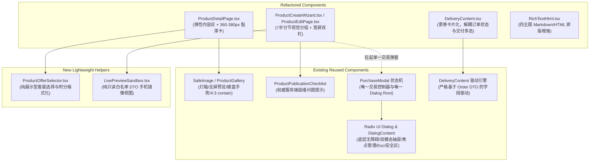
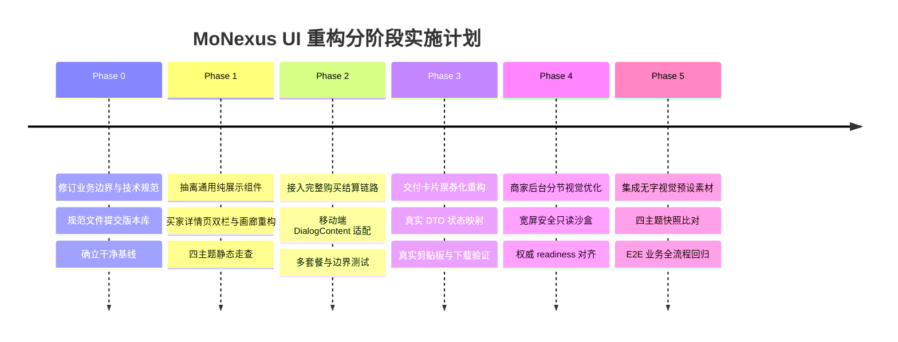

# MoNexus 商品商城 UI 重构与四主题适配实施计划

| 项目 | 值 |
|---|---|
| 计划 ID | PLAN-PRODUCT-COMMERCE-UI-001 |
| 上位规范 | [SPEC-PRODUCT-COMMERCE-002](spec.md) |
| 日期 | 2026-09-10 |
| 状态 | Approved specification baseline；业务边界、状态映射与交互接线已核准 |
| 实施方式 | 独立后续分支与 worktree，单 agent 实施，独立 PR |

---

## 1. 目标、范围与效力

本实施计划旨在将 PR #211（`feat/product-commerce-v2`）引入的商品与交付功能，在前端视觉交互层面进行工程级重塑。

### 1.1 明确替代与细化范围
本计划仅细化和改良 [SPEC-PRODUCT-COMMERCE-002](spec.md) 中 **§10（商品详情与后台响应式设计）** 的具体实现，包括：
1. **四主题（Light / Dark / Soft / Ink）深度自适应**：统一使用 CSS 自定义变量，确保不同主题下无色块断层、对比度达标（WCAG AA）；
2. **桌面端与移动端响应式布局演进**：宽屏下采用“弹性主体 + 360–380px 固定宽购买卡”，移动端复用既有双模态 Dialog 实现自适应半屏抽屉；
3. **交付凭证呈现优化**：采用拟物票券式（Voucher Pass）视觉质感，增强虚拟资产交付体验；
4. **商家编辑体验改善**：优化 7 步发布流程的视觉分节，宽屏下提供安全的只读实时买家视角沙盒预览。

### 1.2 严格遵守的业务边界与契约不变量 (Invariants)
本重构为**纯前端体验优化**，绝不越界修改后端领域模型或制造未承诺的业务假象：
* **禁止数量加减器 (No Quantity Stepper)**：严格遵守“一单购买一个套餐销售单位”原则，结算接口无 `quantity` 参数，前端一律只支持单件套餐选购；
* **严禁虚假服务承诺 (No False Warranty/Authenticity Claims)**：彻底删除“30天无忧质保”、“防伪验证印章”等一切无业务背书的文案与徽章。平台保障仅如实展示官方既定文案：“平台协助售后与争议处理，不另作先行垫付承诺”；
* **严格区分生命周期与凭证概念**：不得将“订阅到期时间”、“平台保障有效截止时间”与“订单售后争议时效”混为一谈；
* **保留真实发布门禁**：不篡改 7 步分节发布流程（信息填写 ➔ 草稿保存获取 ID ➔ 配置库存/文件 ➔ 服务端 readiness 权威核验 ➔ 正式发布）。杜绝所谓的“固定 5 项就绪指标”，就绪检查完全由后端 `publicationIssues` 动态决定；编辑已有商品直接进入对应分节，不强制重新经历向导；
* **数据安全与沙盒边界**：商家端右侧预览沙盒仅接收白名单公开 DTO，严禁将未保存的秘密交付内容、账号密码、上传凭据传入沙盒，严禁在沙盒中挂载会发送真实网络请求或提交订单的完整组件。

---

## 2. 四主题设计系统落地规范

### 2.1 调色板映射与对比度保障 (WCAG AA)
MoNexus 现有主题完全由 `src/index.css` 驱动。所有新写或重构的样式**严禁出现** `bg-white`、`bg-slate-900`、`text-gray-900`、`border-gray-200` 等静态色类。

| 主题 (`data-theme`) | 页面底色 | 容器卡片 | 主交互色 | 兑换强调色 | 文本主色/辅色 | 视觉与圆角特征 |
| :--- | :--- | :--- | :--- | :--- | :--- | :--- |
| **Light** (科技白) | `var(--color-background)` (`#F8FAFC`) | `var(--color-surface)` (`#FFFFFF`) | `var(--color-primary)` (`#4F46E5`) | `var(--color-cta)` (`#15803D`, 5.02:1) | `#0F172A` / `#64748B` | 标准圆角 (8–16px)，利落现代 |
| **Dark** (夜空蓝黑) | `var(--color-background)` (`#0A0A14`) | `var(--color-surface)` (`#161629`) | `var(--color-primary)` (`#818CF8`) | `var(--color-cta)` (`#4ADE80`, 10.2:1) | `#F1F5F9` / `#94A3B8` | 高对比赛博深邃，光晕阴影 |
| **Soft** (暖阳治愈) | `var(--color-background)` (`#FFF8EC`) | `var(--color-surface)` (`#FFFEFB`) | `var(--color-primary)` (`#FF8C42`) | `var(--color-cta)` (`#AD4B35` 暖陶红, 5.48:1) | `#5D3A1F` / `#A07050` | 大圆角 (`--radius-xl: 22px`)，柔和暖意 |
| **Ink** (墨韵默认) | `var(--color-background)` (`#EEF0EE`) | `var(--color-surface)` (`#F8F9F7`) | `var(--color-primary)` (`#34507A`) | `var(--color-cta)` (`#3D7257`, 5.6:1) | `#22262C` / `#666E77` | 宣纸冷白、松烟墨、绫绢灰边 |

### 2.2 样式编写规则
1. **背景与边框**：一律使用 `bg-[var(--color-surface)]`、`bg-[var(--color-background)]`、`border-[var(--color-border)]`；
2. **文字与图标**：一律使用 `text-[var(--color-text)]`、`text-[var(--color-text-muted)]`；
3. **圆角与阴影**：使用 Tailwind 绑定的 `rounded-xl`、`rounded-2xl`，自动响应主题的 `--radius-*` 变量；阴影使用 `shadow-[var(--shadow-md)]` / `shadow-[var(--shadow-lg)]`；
4. **无障碍与缩放**：确保在 200% 页面缩放、大字号下无布局横向溢出，支持 `prefers-reduced-motion` 禁用非必要位移动画。

---

## 3. 组件清单：复用、调整与新增

为避免重建组件库与制造冗余代码，必须严格执行“以复用为主”的工程策略：

### 3.1 复用清单 (Reuse)
* **Radix UI Dialog 与双模态 `DialogContent` (`src/components/ui/Dialog.tsx`)**：
  * 现有 `DialogContent` 已内置响应式双模态机制（`≥md` 居中卡片，`<md` 底部全宽抽屉 `max-md:sheet-enter max-md:bottom-0 max-md:rounded-t-2xl max-md:max-h-[92dvh]`，带顶部拖拽柄与安全区 `var(--safe-bottom)`）；
  * 彻底复用此机制，负责焦点陷阱（focus trap）、遮罩层渲染、Esc 退出与焦点归位（focus restore）；**坚决不新建第二个 Dialog Root**。
* **`SafeImage` 与图片灯箱**：保留全屏浏览、键盘左右切换、原图缩放与图片失败降级能力；
* **`ProductPublicationChecklist`**：严格复用已有就绪度检查组件，展示由 `GET /api/{merchant|admin}/products/:id/editor` 返回的权威 `publicationIssues`；
* **结算提交流程 (`PurchaseModal`)**：
  * **`PurchaseModal` 是整个购买链路中唯一的交易控制器与唯一的 Dialog Root**；
  * 移动端仅通过响应式外壳以底部抽屉形态呈现，所有资料填写、开通邮箱验证、协议勾选与提交均在同一实例中完成；
  * 不复制表单、验证码或提交状态机，杜绝“抽屉关闭后再打开弹窗”的双重 Modal 混乱。
* **履约数据流 (`DeliveryContent`)**：严格依据授权后的订单响应（Order DTO）渲染交付内容，禁止从商品实时属性反推历史订单。

### 3.2 调整清单 (Tweak)
* **`src/pages/ProductDetailPage.tsx`**：
  * 重塑首屏网格为 `flex gap-8 items-start`（宽屏最大宽 1200px），主内容区 `flex-1 min-w-0`，右侧购买卡固定 `w-[360px]` ~ `w-[380px]`；
  * 4:3 图片画廊外框采用 `object-contain` 完整显示，避免裁剪商品核心信息；
  * 遵守单购买入口原则，避免重复渲染购买 CTA。
* **`src/components/DeliveryContent.tsx`**：
  * 外观引入票券切角（Voucher Pass）微拟物设计，彻底移除虚假无忧质保与防伪印章；
  * 严格解耦订单状态 (`order.status`) 与交付内容状态 (`delivery.expired` / 字段形式)，如实反映权限与时效；
  * 敏感信息遮蔽切换，一键复制在 `navigator.clipboard.writeText` 成功后才显示轻提示（若剪贴板 API 失败提供降级选中文本提示）。
* **`src/pages/merchant/ProductCreateWizard.tsx` / `ProductEditPage.tsx`**：
  * 将现有 7 步发布在视觉上整合为 4 个清晰的主阶段向导（基础信息 ➔ 规格价格 ➔ 履约交付 ➔ 确认发布），但底层的每步 API 交互与保存逻辑丝毫不变；
  * 编辑已有商品继续保持直接进入分节表单，不强制经过创建向导。

### 3.3 新增清单 (New)
* **`src/components/catalog/ProductOfferSelector.tsx`**：抽离纯展示型套餐选择器，处理多套餐选中态、库存紧张提示、积分价格展示（无数量加减步进器）；
* **`src/components/merchant/LivePreviewSandbox.tsx`**：商家端右侧辅助预览沙盒，仅接收公开字段白名单构造的只读 DTO，不挂载任何活跃业务 hooks。

---

## 4. 响应式布局与交互规则细化

### 4.1 桌面端 (≥ 1024px)
* **容器规格**：最大宽 1200px，居中对齐；外边距 `px-4 lg:px-8`；
* **信息优先排版 (Header-First Hierarchy)**：
  * 商品名称、一句话用途（如“按需选择额度，交付后在订单中查看凭据”）与核心通用规格前置于页面顶部，置于画廊与购买卡上方；
  * SPU 级标题保持通用（如“开发者 API 额度包”），不硬编码特定套餐的“50M”或“90天”；额度、周期等参数归属各 Offer 并在选择时动态更新；
* **双栏布局**：
  * 左侧内容区：`flex-1 min-w-0`，容纳 4:3 原图 contain 画廊（缩略图导轨 + 真实图片预览）、富文本图文介绍、规格属性表、使用说明、FAQ；
  * 右侧购买卡：`w-[360px]`（或最大 `w-[380px]`），`sticky top-[calc(var(--navbar-current-h)+16px)]`；平台保障说明下沉弱化为卡片底部辅助信息；
* **滚动与内容自适应**：
  * 当商品拥有较多套餐（最多20个）或包含多项购买资料字段时，购买卡内部支持垂直弹性滚动，**绝不强求所有商品均在首屏无滚动展示**；
  * **单购买入口原则 (Strict Single-CTA Rule)**：桌面端右侧购买卡始终随屏吸附停留，已提供持续可见的购买入口。因此，**桌面端坚决不展示顶部 Mini 购买条**（通过 `lg:hidden` 彻底隐藏），杜绝入口重复与视觉干扰。

### 4.2 中屏设备 (768px – 1023px)
* 切换为单列垂直流式排版；首屏画廊与基础信息采用上下堆叠；取消右侧固定卡片，购买模块自然融入正文前部；
* 商家端后台折叠 6:4 双栏，改为“编辑 / 预览”Tab 切换视图；
* 若在此视口启用 Mini 购买条，**必须通过监听首屏非 sticky 购买卡占位锚点 (In-flow Sentinel Anchor)**：仅在首屏卡片完全滚出视口后浮现，且在回滚时收起，确保中屏视口任意时刻也仅有 1 个购买入口。

### 4.3 移动端 (320px – 767px)
* **信息优先与首屏展示**：
  * 顶部轻量级导航（返回、商品详情、分享）；
  * 商品标题与一句话用途同样排在画廊上方，让用户首屏第一时间掌握商品核心信息；
  * 紧随其后为 4:3 比例的克制画廊（包含 1/2 指示与放大图标）；
  * 紧接套餐选择行（带选中外框与打勾标记，展示各套餐专属额度、有效期与积分），下方紧凑展示使用指引与平台保障承诺；
* **常驻底部兑换栏**：高度 56px + `env(safe-area-inset-bottom)`，左侧动态展示已选套餐名与当前积分，右侧为主 CTA；因已常驻底部，**移动端坚决不展示顶部 Mini 购买条**；
* **移动端结算呈现（唯一 Dialog 实例）**：
  * 点击规格或点击底部兑换按钮时，直接拉起 `PurchaseModal`；
  * `PurchaseModal` 依赖现有 `DialogContent` 的 `<md` 规则，直接以全宽半屏抽屉滑出展示；
  * 抽屉内部集成套餐预览、积分余额、开通邮箱验证（如有）、购买表单输入与协议确认；
  * **协议校验时序**：协议未勾选时的警示提示**仅在用户点击提交按钮时触发拦截**，杜绝弹窗刚打开即全屏报红的糟糕体验；
  * 针对软键盘弹出（虚拟键盘唤起），通过 `dvh`（动态视口高度）与内部滚动自适应，保证输入框与提交按钮不被软键盘遮挡。

---

## 5. 订单与交付凭证状态矩阵（映射真实 DTO）

严格以 `src/types/order.ts:43` 中的 `UserOrderDetail` 为真实数据源，**坚决不将状态合并为虚构的单一边界枚举**。页面必须分别解耦读取：
1. **订单主状态 (`order.status`)**；
2. **履约到期与遮蔽标记 (`delivery.expired` / `delivery.contentMasked`)**；
3. **具体交付内容形态 (`structuredContent` / `file` / `url` / `text`)**。

### 5.1 状态与字段映射规则

| 数据字段 | 真实取值与判定 | UI 呈现与业务规则 |
| :--- | :--- | :--- |
| **`order.status`** | `'pending'` / `'processing'` | **处理中**：黄色/蓝色 Badge。展示已付积分、预计时效与买家留言。提示商家/系统正在准备，无敏感凭据。 |
| **`order.status`** | `'delivered'`（兼容旧值 `'completed'`） | **已交付**：绿色 Badge。正常渲染交付物区域（结构化账号、卡密、文件或外部链接）。 |
| **`order.status`** | `'disputed'` | **争议中**：红色 Badge。显示争议处理说明；**文件下载按钮置灰禁用**（后端拒绝发放 presign URL）；**已交付的历史文本/结构化内容按现有契约保留展示，不擅自新增文本遮蔽**。 |
| **`order.status`** | `'refunded'` | **已退款**：橙色 Badge。显示积分已全额返还；**文件下载按钮置灰禁用**；已交付文本内容按既有规则保留历史，不擅自做破坏性遮蔽。 |
| **`order.status`** | `'closed'` | **已关闭**：灰色 Badge。订单已终结。 |
| **`delivery.expired`** | `boolean`（服务端权威判定） | **有效期到期**：仅当 `expired === true` 时显示“已过期”标签，文案根据商品形态准确标注**“有效期至 {expiresAt}”**（卡密/账号类）或**“订阅有效期至 {expiresAt}”**（订阅类），**严禁使用“超过安全存储期”等暗示平台删除凭证的误导文案**。 |
| **`delivery.contentMasked`** | `boolean`（服务端裁决） | **内容已遮蔽**：文本/结构化内容已在服务端脱敏置空，前端如实呈现遮蔽占位符。 |
| **`delivery.file`** | `{ fileName, size, status }` | **文件交付卡片**：展示文件名与大小格式化，支持订单授权签名下载。**删除虚构的 SHA-256 展示要求（买家 DTO 无此字段）**。 |
| **`delivery.structuredContent`** | `{ fields, values }` | **结构化凭据**：分行呈现账号、密码等字段。提供敏感字段遮蔽切换（小眼睛图标），支持单项复制与一键全选复制。 |
| **`delivery.content`** | `string` (`contentType: 'url' / 'text'`) | **链接或纯文本**：URL 渲染为带安全外链图标的卡片；纯文本以等宽字体展示，带复制按钮。 |
| **`provisionPending`** | `boolean` | **自动开通中**：虚线卡片提示“自动开通中，请稍候…（若失败将自动转为人工交付）”。 |

> [!IMPORTANT]
> **真实剪贴板写入反馈**：仅在 `navigator.clipboard.writeText()` 返回 Promise resolved 时，才将复制按钮切换为 Check 图标并显示“已复制”提示（维持 2 秒）。若写入失败，退回为提供选中文本框提示“请长按或手动选中文本复制”。无有效可复制内容时，不渲染复制操作。

---

## 6. 视觉预设素材（Presets）工程规范

* **定位与性质**：生成的 4 张视觉素材仅作为商品封面的**“推荐视觉预设”（Visual Presets）**，供商家或管理员在创建商品时一键选用；绝不作为官方证书、真实软件截图或防伪印章；
* **主题范畴**：
  1. `preset_ai_token.webp`：AI 模型调用与算力概念抽象科技背景；
  2. `preset_cloud_license.webp`：云原生部署与软件架构概念背景；
  3. `preset_membership_pass.webp`：数字会员与社群权益概念背景；
  4. `preset_dev_tools.webp`：开发者代码与工具箱概念背景；
* **技术指标**：
  * 比例与分辨率：4:3 比例，1200 × 900 px；
  * 文件格式与体积：WebP 格式，高质量压缩，单张小于 150 KB；
  * 纯净画面：**画面内绝对不含任何文本、中英文字符、Logo、品牌图标或二维码**，保证作为背景时不与前景 UI 产生视觉冲突；
  * 存放路径：存放于 `public/assets/presets/` 目录下。

---

## 7. 分阶段实施路线图 (Phase 0 – Phase 5)

* **Phase 0: 规范对齐与基线跟踪 (Done)**
  * 将本规范文档沉淀并提交至仓库 `docs/specs/product-commerce-v2/ui-redesign.plan.md`；
  * 确保当前工作树干净，确立后续独立实施的分支基线。
* **Phase 1: 买家详情页重构与四主题静态样稿**
  * 抽离纯展示型 `ProductOfferSelector`；
  * 改造 `ProductDetailPage.tsx`（弹性主体 + 360–380px 固定购买卡 + 4:3 contain 完整画廊）；
  * 在 `light`、`dark`、`soft`、`ink` 4 套主题下进行静态视觉走查；
  * 完整保留现有购买、分享及登录拦截调用链。
* **Phase 2: 移动端抽屉与购买链路全接线**
  * 复用并验证 `PurchaseModal` 在 `DialogContent` 移动抽屉形态下的交互体验；
  * 完整保持现有状态机（Xboard 邮箱验证、价格变动重核、幂等重放）；
  * 验证 320/390px 视口、软键盘弹出以及 20 个套餐边界排版。
* **Phase 3: 订单交付凭证与真实 DTO 映射**
  * 改造 `DeliveryContent.tsx` 为票券卡片式呈现，解耦读取订单状态与交付字段；
  * 接入真实剪贴板写入与成功反馈，验证争议/退款下的文件下载禁用逻辑与到期文案。
* **Phase 4: 商家向导分节与只读预览沙盒**
  * 优化 7 步表单视觉分组；
  * 实现宽屏 `LivePreviewSandbox`（仅传白名单只读字段，无网络请求）；
  * 联动已有 `ProductPublicationChecklist`，精确反映后端校验结果。
* **Phase 5: 预设素材集成与视觉全回归**
  * 生成并部署 4 张无文字纯净 WebP 预设封面至 `public/assets/presets/`；
  * 运行关键页面四主题快照核对；
  * 运行现有 E2E 业务测试集，确保无回归破损。

---

## 8. Git 分支管理与协作策略

1. **版本库基线**：本次修订已直接作为正式工程规范提交到 Git 版本库（`docs/specs/product-commerce-v2/ui-redesign.plan.md`）。
2. **独立特性分支与 worktree 开发**：
   * 方案定稿后，待 PR #211 合并入 `develop`（或从包含该文档的明确提交点），创建独立分支 `feat/product-commerce-ui-v2`；
   * 在独立的 git worktree 中开启单 agent 纯前端重构；
   * 遵循现行分支规范，完成后发起独立的后续 Pull Request。
